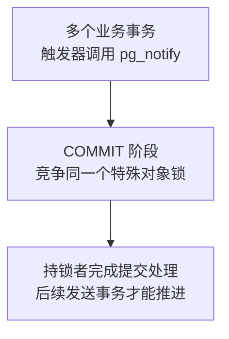
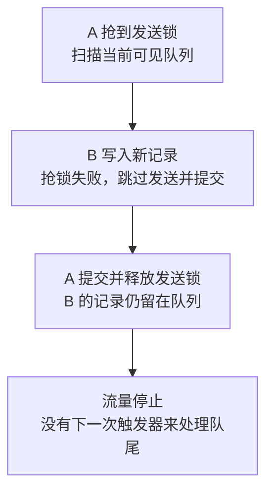

# 如何排查 LISTEN／NOTIFY 引起的提交阻塞

> 会议精选 · PG DATA 2026 · 锁、事务与在线变更<br>
> 基于 Jimmy Angelakos（pgEdge）的 [LISTEN Carefully: How NOTIFY Can Trip Up Your Database](https://vyruss.org/computing/slides/pgdata2026_listen_carefully.pdf) 整理。演讲时间：2026-06-05，Chicago。<br>
> 中文整理与技术校订：xiongcc。本文在原案例基础上补充了 PostgreSQL 16.14 的源码分析与复现实验。

业务 SQL 看起来并不慢，事务却卡在 COMMIT。排查锁等待时，日志里出现了这样一个对象：

```text
object 0 of class 1262 of database 0
```

这是什么锁？为什么发送一条通知，会影响业务事务提交？

Jimmy Angelakos 在 PG DATA 2026 分享的案例就遇到了这个问题。当时数据库通过触发器发送 NOTIFY，旧应用收到通知后，再把事件转发到 Redis。随着流量增长，这条通知链路开始拖慢事务提交。

原因藏在 NOTIFY 的提交处理中。下面从两个会话的收发开始，看它什么时候需要锁，以及如何确认自己的数据库是否也卡在这里。

## NOTIFY 在什么时候发送？

先看两个连接到**同一个数据库**的会话。

会话 A 注册监听，使用自动提交，或者显式提交 LISTEN 所在事务：

<!-- example: listen -->
```sql
LISTEN order_watchers_json;
```

会话 B 发送通知：

<!-- example: publish -->
```sql
BEGIN;
SELECT pg_notify('order_watchers_json', '{"order_id":42,"status":"completed"}');
COMMIT;
```

A 可以收到 channel、payload 和发送进程 PID。如果用 psql 做实验，可能需要再执行一条查询，终端才会显示通知。应用程序通常通过驱动提供的接口接收。

这里有几个使用时需要注意的细节：

- 发送事务提交后，通知才会对外生效；回滚则不发送。
- LISTEN 的注册也在提交时生效，且绑定数据库会话。接收连接应保持可用，避免长事务。
- 同一个事务里，相同 channel、相同 payload 的重复通知可以被合并；不同事务的通知不会因此合并。
- 默认配置下 payload 必须**小于 8000 字节**，不是 8000 个字符。中文和 JSON 都要按字节计算。
- 离线期间的通知不会在重连后自动补发；没有业务消费确认、重试和持久订阅进度。

这意味着 NOTIFY 更适合告诉应用“有变化，过来看一下”。需要断线后补领的事件，仍要另外保存。payload 也不要携带敏感凭证，同一数据库里的其他会话可以监听这个 channel。[NOTIFY 文档](https://www.postgresql.org/docs/18/sql-notify.html)

## COMMIT 为什么会排队？

回到日志里的 class 1262，它对应 `pg_database`。这里很容易误以为有人锁住了系统表，实际上，NOTIFY 借用了这个目录的编号来标识一个特殊对象锁，锁类型是 `object`，而非 `relation`。

沿 PostgreSQL 16.14 的 `PreCommit_Notify()` 往下看，带有待发送通知的事务会取得这把重量级锁，串行地向通知队列写入数据。锁会一直持有到事务结束，从而保证通知队列的提交顺序。[对应源码](https://github.com/postgres/postgres/blob/REL_16_14/src/backend/commands/async.c#L940)



一次事务中的多条通知会一起处理。因此，100 个事务各发送一条通知，比一个事务集中发送 100 条通知，有更多事务参与这把锁的竞争。不发送通知的普通事务，不会因为这段处理而来抢锁。

还有一个不太直观的地方：**通知只在当前数据库内投递，这把特殊锁却在同一个实例内共享。** 换 channel，甚至换到同实例的另一个数据库，仍可能互相等待。

为确认这一点，本次在独立的 PG16.14 临时集群里做了一个实验：让数据库 A 中的事务写入数据并发送通知，再人为制造同步复制等待，使它停在提交阶段。随后，在数据库 B 中向另一个 channel 发送通知。

观察结果如下。表中只保留与判断有关的字段，完整检查脚本见文末：

| 会话 | 所在数据库 | 对象锁模式 | granted | 等待状态 |
| --- | --- | --- | --- | --- |
| howto100-A | postgres | AccessExclusiveLock | true | SyncRep |
| howto100-B | notify_other | AccessExclusiveLock | false | Lock 类型等待 |

A 等待同步复制时仍然持锁，B 因而无法完成通知提交。解除实验中的同步复制等待后，两边都正常完成了提交。排查时，除了寻找 NOTIFY 的等待者，还得继续看持锁事务卡在哪里。

这个实验通过配置一个不存在的同步备库名称来制造等待，没有搭建真实备库。配置只用于隔离实验，别在业务库里照做。下文涉及的内部锁标识也以 PG16.14 为准，其他版本需核对对应源码。

## 在自己的数据库里怎么查？

先看活跃等待，再定位具体锁：

<!-- example: activity -->
```sql
SELECT pid, datname, application_name, state,
       wait_event_type, wait_event,
       clock_timestamp() - xact_start AS xact_age,
       pg_blocking_pids(pid) AS blockers,
       query
FROM pg_stat_activity
WHERE wait_event IS NOT NULL
  AND pid <> pg_backend_pid()
ORDER BY xact_start NULLS LAST;
```

针对上述源码路径，可以筛选特殊对象锁。使用目录名称获得 OID，而不是直接写死 1262：

<!-- example: notify-locks -->
```sql
SELECT l.pid, a.datname, a.application_name,
       l.locktype, l.mode, l.granted,
       l.database, l.classid, l.objid, l.objsubid,
       a.wait_event_type, a.wait_event,
       pg_blocking_pids(l.pid) AS blockers,
       a.query
FROM pg_locks AS l
LEFT JOIN pg_stat_activity AS a ON a.pid = l.pid
WHERE l.locktype = 'object'
  AND l.database = 0
  AND l.classid = 'pg_catalog.pg_database'::regclass
  AND l.objid = 0
  AND l.objsubid = 0
ORDER BY l.granted, l.pid;
```

重点找 `granted=false` 的等待者与 `granted=true` 的持锁者，再看持锁者的 `wait_event`。查看其他用户的完整查询需要相应监控权限；如果等待很短，一次查询可能恰好错过，需要在问题发生时多采几次。

排查触发器时，可以先列出定义，再阅读其调用函数：

<!-- example: triggers -->
```sql
SELECT t.tgrelid::regclass AS table_name,
       t.tgname,
       t.tgfoid::regprocedure AS trigger_function,
       pg_get_triggerdef(t.oid) AS definition
FROM pg_trigger AS t
WHERE NOT t.tgisinternal
ORDER BY 1, 2;
```

`pg_notify` 也可能藏在间接调用的函数或应用 SQL 中，不能只搜索触发器文本。

### 通知队列占用是另一个指标

<!-- example: queue-usage -->
```sql
SELECT pg_notification_queue_usage();
```

这个值反映 PostgreSQL 内部通知队列的占用比例。即使队列很空，发送事务之间也可能有锁竞争，两个指标要分开看。

如果占用持续上涨，可以检查监听连接是否长时间停留在事务中，这会拖延通知交付或队列清理。队列满时，带 NOTIFY 的事务可能在提交阶段失败。

## Jimmy 的处理办法：合并发送

旧应用不方便改，Jimmy 就把调整放在了数据库触发器里：

1. 触发器将 payload 插入一张 UNLOGGED 暂存表。
2. 使用 `pg_try_advisory_xact_lock()` 非阻塞地争取发送资格。
3. 没拿到锁的事务跳过发送；拿到锁的事务读取可见队列记录，批量调用 `pg_notify()`。
4. 发送者在提交时一次处理本事务积累的通知。

这样，多个业务事务积累的通知有机会由一次发送事务集中处理，竞争就少了。代价是抢到 advisory lock 的那个业务事务需要多做一些工作：读取暂存记录、发送通知，然后完成自己的提交。其余事务跳过发送，但正常的行锁、I/O 和提交等待仍然存在。

原文的压力测试使用了带同步备库的生产克隆环境，调整后吞吐有所改善。本次没有重做吞吐测试，重点检查的是这段做法在低流量和停流时会怎样。

## 暂存表里的通知会不会漏发？

### 先看 UNLOGGED 的取舍

UNLOGGED 表的数据变更不写普通 WAL，异常停机恢复后会被清空，内容也不会复制到物理备库。业务表成功提交，不代表对应暂存事件在故障切换后还存在。[UNLOGGED 语义](https://www.postgresql.org/docs/18/sql-createtable.html)

如果通知只是“缓存可能过期，请重新读取状态”，而状态可从持久数据重建，这个取舍可能成立。如果消费者必须逐条处理每一次变更，暂存表的数据丢失就会成为业务问题，需要采用持久存储。

### 10 秒以前的数据究竟去了哪里？

原演讲第 19–20 页先 DELETE 一批可见记录，再从 `RETURNING` 结果里筛出最近 10 秒的记录发送。**外层过滤不会撤销 DELETE：更旧的记录也被删除，只是不发送。**

本次用一条 20 秒以前的记录验证了这个行为：执行删除和外层过滤后，待发送结果为 0 条，暂存表中的记录也变成了 0 条。这条通知已经被丢弃。

所以，10 秒窗口本身就是一项业务取舍。尤其要留意长事务：记录刚刚提交、对发送者可见时，生成时间可能已经超过 10 秒。

### 没有下一笔业务写入，队尾由谁发送？

考虑下面的并发时序：



按这个顺序安排两个会话后，实验结果是：B 抢锁返回 false，A 提交结束后，暂存表里还剩 1 条记录。

A 的扫描快照看不到 B 后来提交的记录。如果后续一直有业务写入，下一次触发器还有机会把它带走；流量一停，这条记录就留下了。因此，采用类似做法时还需要周期性补扫。压测结束后再看一眼队尾，往往比持续加压时更容易发现这个问题。

这里复现的是幻灯片公开代码的最小模型，Jimmy 的完整应用是否有其他补扫逻辑，材料中没有给出。

批量发送也要限制每批数量，否则积压会集中压到一个业务事务上。单条 payload 超限就可能使发送报错、事务回滚。监控时除了暂存数量，也值得记录最老事件的年龄，少量记录长期不动同样需要处理。

## 如果事件不能丢，怎样使用 NOTIFY？

在这个案例之外，还有一种值得考虑的做法：把事件保存在普通表里，与业务变更在同一个事务中提交。NOTIFY 只用于唤醒消费者，消费者回到表里领取待处理事件。这样，即使错过通知，数据还在。

下面是一个简化的 outbox 表，用来说明数据和通知如何分开：

<!-- example: outbox -->
```sql
CREATE TABLE app_outbox (
    event_id bigint GENERATED ALWAYS AS IDENTITY PRIMARY KEY,
    created_at timestamptz NOT NULL DEFAULT clock_timestamp(),
    event_type text NOT NULL,
    payload jsonb NOT NULL,
    processed_at timestamptz
);

CREATE INDEX app_outbox_pending_idx ON app_outbox (event_id)
WHERE processed_at IS NULL;
```

为了减少业务事务对通知锁的竞争，可以由独立发送者定期检查待处理事件、合并发送唤醒通知：

<!-- example: wakeup -->
```sql
SELECT pg_notify('outbox_wakeup', 'pending')
WHERE EXISTS (
    SELECT 1 FROM app_outbox WHERE processed_at IS NULL
);
```

这条查询在发送者自己的短事务中执行，发送间隔取决于业务能接受的延迟。发送通知后，事件仍保留为待处理状态，只有消费者处理成功才确认。

消费者启动时，应先 LISTEN 并提交，再在新事务里扫描已有待处理数据；之后响应通知，同时保留周期性补扫。重连后重新注册并重新扫描。[监听初始化规则](https://www.postgresql.org/docs/18/sql-listen.html)

这需要调整消费逻辑，不能直接替换原案例中的触发器。示例也只表达单消费状态：实际使用还要处理失败重试与幂等，多消费者则需要领取协调。扫描进度不要简单取 `max(event_id)`，小 ID 的事务可能比大 ID 更晚提交，按最大值推进会漏掉它。

## 回到提交阻塞本身

遇到 COMMIT 慢，如果系统里恰好有触发器发送 NOTIFY，可以先查本文的对象锁，再追持锁事务的等待状态。盲目增加连接数或调大 `lock_timeout`，解决不了已经确认的发送串行化问题。取消提交等待也要谨慎，等待同步复制时，事务可能已经在本地提交了。

Jimmy 的案例提供了一个减少发送事务数的办法。真正落地时，最值得补测的是两个时刻：通知积压超过过期窗口时，以及最后一笔业务写入结束后。它们决定了队列里哪些消息会被发送，哪些可能被丢弃或留下。

## 资料与复现

- [PG DATA 2026 原始幻灯片](https://vyruss.org/computing/slides/pgdata2026_listen_carefully.pdf) · [Jimmy Angelakos 的演讲索引](https://vyruss.org/computing/)。故障案例和合并发送方案来自这份材料；文中的实验与 outbox 示例是补充内容。
- [PG16.14 async.c](https://github.com/postgres/postgres/blob/REL_16_14/src/backend/commands/async.c#L940)。本次核对的通知提交实现。
- [第 100 篇验证记录](/maintenance/100-validation.md)。包含隔离集群的复现方式与检查结果。本次没有测试吞吐、真实备库、崩溃恢复或完整消费链路；UNLOGGED 的恢复行为依据官方文档。

继续阅读：[锁分析](/docs/22.md) · [复制延迟排查](/docs/93.md) · [会议精选](/docs/conferences.md)
