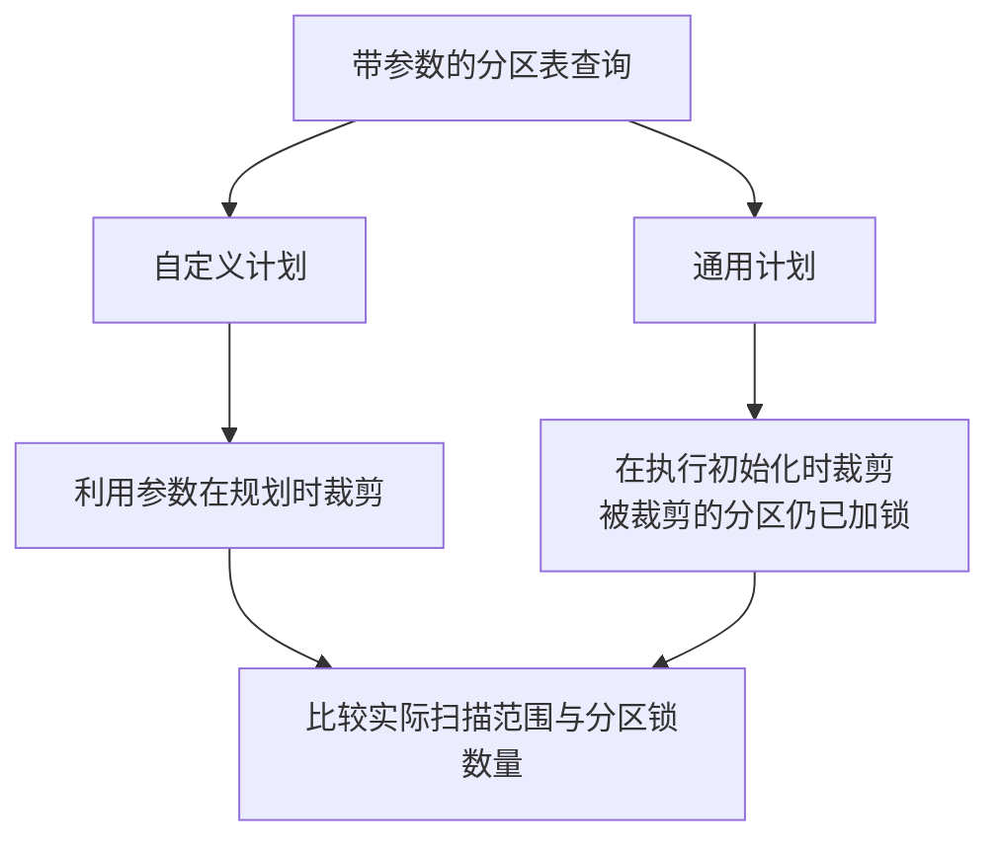

# PostgreSQL 性能排查：规划开销、分区锁与表膨胀

> 专题解读 · Postgres Conference 2026 · 查询性能与观测<br>
> 基于 Anita Singh、Ranjan Burman（AWS）的 *Stop Guessing: How to Actually Fix PostgreSQL Performance* 整理，分享于 2026-04-22，San Jose。<br>
> 中文整理与技术校订：xiongcc。

一条 SQL 执行得慢，通常会从执行计划查起。但实际排查中，有些查询执行只花了几毫秒，规划却用了几百毫秒；有些查询只扫描一个分区，并发上来后却出现了锁管理器等待。还有一些数据库，业务量没变，读 I/O 却随着表膨胀持续增加。

Anita Singh 和 Ranjan Burman 在这次分享中讨论了几类常见的性能问题。本文选取其中的规划开销、分区锁、Vacuum 和连接管理展开，并补充几组 PostgreSQL 18.4 实验。

## 确认变慢的环节

接口响应时间、数据库执行时间和 CPU 使用率描述的是不同的事情。接口可能在等连接，SQL 可能在等锁，数据库也可能只是收到了更多请求。排查时，需要把业务延迟、请求量、活跃连接和系统资源放在同一个时间段里比较。

应用发布、连接池调整、数据库参数变更，以及批处理任务的开始时间，也值得一起记录。很多突发退化都能从这些变化中找到线索。

| 现象 | 优先检查 |
| --- | --- |
| 接口变慢，SQL 执行时间变化不大 | 连接池等待、网络往返、结果传输、事务提交，以及应用的计时范围 |
| CPU 升高 | 调用量、活跃会话、具体 backend 的 CPU、执行计划和并行 worker |
| 可用内存减少 | 连接数与会话状态、进程私有内存、排序/哈希操作和临时文件 |
| I/O 增加，业务量没有明显变化 | 单次查询读块数、表与索引大小、临时读写、checkpoint 和清理进度 |
| 查询出现明显等待 | 等待类型、涉及会话和发生时段；重量级锁等待还需检查阻塞链 |

`pg_stat_activity` 用来看当前会话，`pg_stat_statements` 用来找一段时间内消耗较大的 SQL。后者的总执行时间包含等待，不能直接当作 CPU 时间。分析一次刚发生的故障时，应比较故障前后的统计增量，避免被长期累计值干扰。

找到 SQL 后，再用 `EXPLAIN (ANALYZE, BUFFERS)` 看实际行数、循环次数、读块情况和耗时。注意，`ANALYZE` 会真正执行语句；昂贵查询和写操作需要先评估负载与副作用。计划节点的耗时有包含关系，也不能直接相加。

## 统计信息与规划开销

原分享有一个案例：数据库级 `default_statistics_target` 从 300 提高到 8000 后，CPU 上升，查询性能下降。展示的计划中，规划时间约 598 ms，执行时间却只有约 1.5 ms。后来缩小了统计信息调整的范围，改为按需要设置列级统计目标，规划时间降到了约 0.203 ms。

这类查询的主要开销发生在规划阶段。继续优化执行算子，即使把那 1.5 ms 全部省掉，对总耗时的帮助也很有限。

提高统计目标会允许更详细的统计信息，同时增加采集和处理成本。实际调整时，可以先看估算行数与实际行数从哪个节点开始偏离，再检查相关列的数据分布。少数列有明显倾斜，就针对这些列处理；如果偏差来自多列之间的关联关系，则需要考虑扩展统计信息。

规划时间还受分区数量、连接关系复杂度和计划复用等因素影响。尤其对于执行很快、调用频繁的短 SQL，规划开销很容易积累。只比较 Planning Time 与 Execution Time 的比例还不够，还要看绝对耗时和调用次数。

索引也需要结合访问量判断。顺序扫描可能是合理选择，关键在于查询要读取多少数据，以及索引能减少多少访问。复合 B-tree 索引缺少前导列条件时仍可能被使用，只是扫描范围往往更大；PostgreSQL 18 的 skip scan 可以改善其中一些情况，效果取决于前导列的不同值数量和整体成本。

## 分区表上的预备语句

预备语句可以使用自定义计划（custom plan）或通用计划（generic plan）。自定义计划根据本次参数生成；通用计划可以复用，省去重复规划的开销。参数分布比较均匀时，复用通常更有利；不同参数对应的数据量相差很大时，就需要留意通用计划的执行效果。

对带参数的预备语句，`plan_cache_mode = auto` 会在前五次执行时使用自定义计划，随后比较通用计划与此前自定义计划的平均估算成本，再决定是否切换。

本次实验创建了一张 10 万行的表，其中 99,900 行具有相同的键值，其余 100 行各自不同。针对一个稀有值连续执行 10 次后，`pg_prepared_statements` 中的计数为 `custom_plans = 10`、`generic_plans = 0`。因此，排查计划变化时应检查实际选择，不能仅凭“执行到了第六次”判断已经切换。`EXPLAIN EXECUTE` 和会话内的 `pg_prepared_statements` 都可以帮助确认。

原分享还讨论了分区表的锁开销。参数在规划时已知，可以提前裁剪分区；通用计划可能要等到执行初始化时才能完成裁剪，而此时相关分区已经被锁住。

为了观察这一点，本次在 PostgreSQL 18.4 中建立了 12 个范围分区，每个分区 1,000 行。用同一个参数查询一个分区，分别强制两种计划模式，得到以下结果：

| 计划模式 | 实际扫描的叶子分区 | 持有 AccessShareLock 的叶子分区数 |
| --- | --- | --- |
| `force_custom_plan` | `events_0` | 1 |
| `force_generic_plan` | `events_0` | 12 |

通用计划的执行计划中显示 `Subplans Removed: 11`，最后只扫描了 `events_0`，但查询所在事务仍持有全部 12 个叶子分区的锁。表中只统计叶子分区，未计入父表和系统目录。



当分区和并发会话都很多时，频繁申请关系锁可能带来锁管理器争用。遇到 `LWLock:LockManager` 等待，可以沿着计划模式、分区数量、索引数量和并发量继续检查。上面的实验说明了锁范围的差异，等待是否会成为瓶颈，还要看实际并发负载。

可以在受控会话中比较两种计划模式的规划时间、执行时间和等待变化。全局强制自定义计划会增加重复规划的成本，不宜直接作为默认修复。分区粒度的调整也应结合数据保留、查询方式和维护需求一起考虑。

## 长事务拖延 Vacuum 清理

另一个案例中，业务量没有明显变化，读 IOPS 却大幅增加。原因与只读实例上的长查询有关：开启 `hot_standby_feedback` 后，备库把旧快照的回收边界反馈给主库，主库因此需要继续保留相关行版本。

这种情况下，Vacuum 可以正常运行，却无法删除仍被快照需要的旧版本。它们长期积累后，表和索引体积增大，同样的查询就可能读取更多页面。

所以，看到清理跟不上时，除了检查 autovacuum 的资源和触发条件，还要检查长事务、备库反馈和复制槽保留的回收边界。如果旧快照一直存在，仅增加 worker 或提高清理频率，效果会很有限。

`hot_standby_feedback` 能减少备库查询因清理冲突而被取消的情况，代价是主库可能积累更多旧版本。报表查询允许运行多久、能否取消重试、主库能接受多少清理延迟，都需要结合业务确定。

这里要注意两个超时参数的作用范围：`max_standby_streaming_delay` 控制的是 WAL 回放遇到冲突时允许的等待，并非所有备库查询的运行时长上限。需要限制查询执行时间时，应另行考虑 `statement_timeout`。

普通 Vacuum 回收的空间主要供关系内部复用，文件大小通常不会明显下降。需要重写文件时，`VACUUM FULL` 会取得 `ACCESS EXCLUSIVE` 锁，阻塞对该表的正常访问，必须安排合适的维护窗口。即使决定重写，也应先处理旧版本持续积累的原因。

## 单独检查 TOAST 的大小和清理情况

业务表包含较大的 `text`、`jsonb` 或 `bytea` 值时，部分数据可能存放在关联的 TOAST 表中。只看主表大小或主表的死元组统计，容易漏掉这部分空间的变化。

TOAST 是否使用行外存储，取决于行大小、列存储策略和压缩结果，并没有“某列超过 2 KB 就一定外置”的固定规则。默认对主表执行 Vacuum 时，也会处理它的 TOAST 表。

本次实验对一张含大文本的表进行更新，用 `pgstattuple` 检查关联 TOAST 表，得到 850 个死元组。随后只对主表执行 `VACUUM`，TOAST 的死元组数降到了 0。检查 TOAST 时，应分别观察旧版本是否被清理，以及清理后的空间是留在文件内部复用，还是已经归还给操作系统。

下面的查询可以查看主表、索引与 TOAST 的大小。它按普通表列出数据，分区表按叶子分区显示，不汇总父表，并排除了系统 schema 和临时表。

```sql
SELECT n.nspname AS schema_name,
       c.relname AS table_name,
       pg_size_pretty(pg_relation_size(c.oid)) AS heap_main_size,
       pg_size_pretty(pg_indexes_size(c.oid)) AS table_indexes_size,
       pg_size_pretty(pg_total_relation_size(c.reltoastrelid))
           AS toast_total_size,
       pg_size_pretty(pg_total_relation_size(c.oid)) AS total_size
FROM pg_class AS c
JOIN pg_namespace AS n ON n.oid = c.relnamespace
WHERE c.relkind = 'r'
  AND c.relpersistence <> 't'
  AND c.reltoastrelid <> 0
  AND n.nspname <> 'information_schema'
  AND n.nspname !~ '^pg_'
ORDER BY pg_total_relation_size(c.reltoastrelid) DESC
LIMIT 20;
```

`heap_main_size` 仅统计主表的主 fork；`toast_total_size` 包含 TOAST 自身的索引和辅助 fork；`total_size` 已包含主表索引及 TOAST，不能再次相加。

这些数值反映的是对象大小，不是膨胀率。对于大文档，TOAST 本身就可能占用主要空间。是否需要处理膨胀，还要结合实际数据量、更新频率、死元组和清理情况判断。

## 连接数与内存预算

分享中还有一个低负载、只读业务出现内存压力的案例，最终通过连接管理缓解。大量空闲连接仍会占用内存，而会话用过的查询、缓存的状态和扩展，也会影响它的实际占用。

评估内存时，`work_mem` 尤其容易被误用。它限制的是排序、哈希等查询操作的内存使用，不是连接建立后预先分配的固定额度。一条复杂 SQL 可能同时运行多个这样的操作，多个会话和并行 worker 也可能同时消耗内存。哈希操作还受 `hash_mem_multiplier` 影响。

因此，内存预算需要估计高峰期有多少活跃查询、每条查询有哪些主要操作，以及是否启用并行。单纯用 `max_connections × work_mem`，无法得到完整的内存上限。

如果发现排序落盘，可以先针对该查询调整 `work_mem`，比较耗时和临时 I/O，再放到有代表性的并发下测试。直接提高全局配置，可能让单条查询变快，却让高峰期的内存更紧张。

连接池也需要同时观察应用和数据库两端。数据库连接数降下来了，但应用等待连接的时间大幅增加，接口延迟未必改善。池的大小应与实例能够承担的活跃并发相匹配；选用事务池等模式前，还要检查应用是否依赖会话状态。

## 调整后的验证

验证指标应与调整目标对应。统计信息调整后，要比较规划时间、行数估算和执行计划；计划模式调整后，要看规划成本、执行耗时与并发等待；清理策略调整后，要继续观察死元组、对象大小和读 I/O 的变化。

保留调整前的参数和观测结果，每次尽量只改变一个因素，方便比较和回退。复测时使用相近的数据量、参数分布与并发，除了平均耗时，也关注尾延迟、吞吐量和资源余量。

如果一次改动同时包含加索引、改参数和扩容，即使性能恢复，也很难确定是哪一项起了作用。紧急处置可以优先恢复业务，之后仍值得把几项变化分别验证，留下可供下次排查使用的记录。

## 参考资料

- Anita Singh、Ranjan Burman：[Stop Guessing: How to Actually Fix PostgreSQL Performance](https://postgresconf.org/conferences/postgresconf_2026/program/proposals/postgresql-statistics-unleashed-mastering-query-optimization-through-data-driven-insights)，Postgres Conference 2026，2026-04-22。
- 性能观测：[统计视图](https://www.postgresql.org/docs/18/monitoring-stats.html)、[pg_stat_statements](https://www.postgresql.org/docs/18/pgstatstatements.html)、[EXPLAIN](https://www.postgresql.org/docs/18/sql-explain.html)。
- 执行计划：[规划器统计信息](https://www.postgresql.org/docs/18/planner-stats.html)、[多列索引](https://www.postgresql.org/docs/18/indexes-multicolumn.html)、[PREPARE](https://www.postgresql.org/docs/18/sql-prepare.html)、[分区裁剪](https://www.postgresql.org/docs/18/ddl-partitioning.html#DDL-PARTITION-PRUNING)。
- 存储维护：[日常清理](https://www.postgresql.org/docs/18/routine-vacuuming.html)、[复制参数](https://www.postgresql.org/docs/18/runtime-config-replication.html)、[VACUUM](https://www.postgresql.org/docs/18/sql-vacuum.html)、[TOAST](https://www.postgresql.org/docs/18/storage-toast.html)、[对象大小函数](https://www.postgresql.org/docs/18/functions-admin.html#FUNCTIONS-ADMIN-DBSIZE)。
- 内存：[资源参数](https://www.postgresql.org/docs/18/runtime-config-resource.html)。
- 本文补充实验使用 PostgreSQL 18.4，详见[实验记录](/maintenance/101-review.md)。

## 相关阅读

- [EXPLAIN 为什么应该带 BUFFERS](/docs/1.md)
- [为 pg_stat_statements 找到真实 SQL 样例](/docs/12.md)
- [处理 bloat](/docs/46.md)
- [work_mem 调优](/docs/92.md)
- [性能优化推荐路径](/docs/paths.md)
