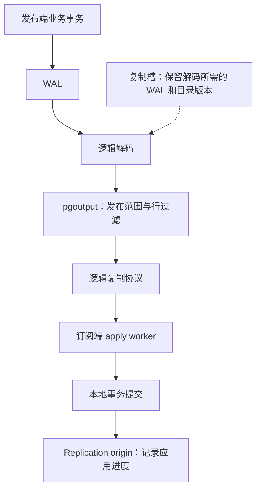

# How to Hack on Logical Replication: Insights from contributors

> 专题解读 · PGConf.dev 2026 · 复制、校验与升级<br>
> 基于 Hayato Kuroda、Zhijie Hou（Fujitsu）的同名分享整理，分享于 2026-05-21。<br>
> 中文整理与技术校订：xiongcc。

逻辑复制的入门示例很短：发布端建一个 publication，订阅端建好表，再创建 subscription，数据便能持续传过来。

但真正修改这部分代码时，问题很快会超出这几条 SQL。一个 publication 明明存在，为什么解码时可能查不到？事务已经回滚，为什么复制槽还在？普通 apply worker 修过的问题，为什么到了并行 worker 又出现一次？

Hayato Kuroda 和 Zhijie Hou 在这次分享中讨论的，正是参与逻辑复制开发时遇到的这些问题。性能分析、SQL 语义、历史快照、崩溃恢复和进程协作，都可能影响一项看似局部的改动。对于日常使用逻辑复制的人，理解这些约束，也有助于判断复制延迟、DDL 变更和恢复过程中的异常。

## 一条变更经过哪些环节

内置逻辑复制使用 `pgoutput` 输出插件。发布端从 WAL 中解码事务变化，根据 publication 的范围、行过滤等规则决定发送什么；订阅端接收协议消息，再把变更应用到本地表。



这里省略了初始表同步和并行应用的细节。先关注两个位置：发布端需要知道“哪些历史数据还不能清理”，订阅端需要知道“远端事务已经应用到哪里”。复制槽和 replication origin 分别参与这两件事，它们的状态必须与数据、WAL 和恢复过程相互配合。

初始同步则还有另一条路径：table synchronization worker 先复制表中已有数据，再追赶期间产生的变化，最后把表交给正常应用流程。因此，测初始同步速度、测 WAL 解码速度、测订阅端追赶速度，得到的是不同的结果。

## 性能测试要能区分解码和应用

两端都启动后直接跑 `pgbench`，可以测整体表现，但很难凭一个吞吐数字知道瓶颈在哪。原分享将测试分成发布端解码和订阅端追赶两个方向。

**测发布端时，可以先让消费者只接收，不执行本地写入。** `pg_recvlogical` 能读取逻辑复制流，把输出写到 `/dev/null`，从而移除订阅端建索引、检查约束、写表和提交等开销。它仍包含解码、输出插件、协议传输和客户端接收的成本，并不是纯粹的某个解码函数计时。

下面是一组用于验证测试流程的小例子。只在独立实验库运行，发布端需启用 `wal_level=logical` 并配置足够的复制槽和 WAL sender。先设置 `PGHOST`、`PGPORT`、`PGUSER`、`PGDATABASE`，让 `psql` 与 `pg_recvlogical` 指向同一个实验库；不要复用生产订阅的槽。

```bash
set -euo pipefail
: "${PGDATABASE:?Set PGDATABASE to a disposable test database}"

psql -X -v ON_ERROR_STOP=1 -c \
  "CREATE TABLE public.decode_demo(id integer PRIMARY KEY, payload text);"
psql -X -v ON_ERROR_STOP=1 -c \
  "CREATE PUBLICATION decode_demo_pub FOR TABLE public.decode_demo;"
pg_recvlogical -d "$PGDATABASE" --slot=decode_demo_slot \
  --create-slot --plugin=pgoutput
trap 'pg_recvlogical -d "$PGDATABASE" --slot=decode_demo_slot --drop-slot' EXIT

psql -X -v ON_ERROR_STOP=1 -c \
  "INSERT INTO public.decode_demo SELECT g, repeat('x',100) FROM generate_series(1,10000) AS g;"
end_lsn=$(psql -X -v ON_ERROR_STOP=1 -Atc 'SELECT pg_current_wal_lsn()')
time pg_recvlogical -d "$PGDATABASE" --slot=decode_demo_slot \
  --start --no-loop --endpos="$end_lsn" \
  -o proto_version=1 -o publication_names=decode_demo_pub -f /dev/null

psql -X -v ON_ERROR_STOP=1 -c \
  "DROP PUBLICATION decode_demo_pub; DROP TABLE public.decode_demo;"
```

顺序很重要：**先创建槽，再产生负载，最后记录终点 LSN 并消费到该位置。** 槽没有保留的历史 WAL，不能指望测试时再补回来。这段命令使用协议版本 1，测的是非 streaming 的基础路径；它已经在 PostgreSQL 18.4 实验环境中执行通过。

正式比较补丁前后的性能，需要固定事务大小、表结构、数据量和 WAL 范围，重复测试，并配合 `perf` 查看热点。每次比较应重新准备可比的起点；一个槽已经消费过的范围，不能简单重复同一条命令就当成第二次测试。实验异常中断后，也要检查槽是否清理，避免持续保留 WAL。

**测追赶时，则需要完整的发布订阅链路。** 可以在初始表同步结束后暂停订阅，积累一批固定变更，再启用订阅观察追赶。记录发布端的终点，并核对订阅端应用进度及最终数据；只看 `received_lsn` 或进程是否仍活跃，不能证明这些变化已经提交到订阅表。这个测试测得的是端到端追赶能力，仍应结合两端 profile，判断时间花在哪里。

原分享中的一个优化来自“不发布任何业务变更”的测试。虽然变更最终被过滤掉，`get_rel_sync_entry()` 仍对每条变化查询关系类型和分区信息。提交 `6ce1608` 把这两次查询移入缓存建立或重建的路径，减少了重复访问。

因此，负载也应包含大量未发布表的写入。订阅的数据量很小，并不代表发布端为了判断这些变化是否需要发送而付出的成本也很小。

## SQL 语法背后，还要考虑后续 DDL

`CREATE PUBLICATION ... FOR TABLES IN SCHEMA` 会把指定 schema 中现有和未来创建的、符合条件的表纳入发布范围。它与 `GRANT ... ON ALL TABLES IN SCHEMA` 不同，后者操作的是执行授权时已有的对象；未来对象的权限需要另行配置默认权限。

材料提到，这也是语法没有沿用 `FOR ALL TABLES IN SCHEMA` 的原因之一：相似写法容易让人误以为两者具有相同的时间范围。

本次实验中，publication 创建之后新增的表，立即出现在发布端的 `pg_publication_tables` 中。但订阅端并没有自动增加该表的同步状态。仍需先准备订阅端表结构，再执行 `ALTER SUBSCRIPTION ... REFRESH PUBLICATION`。**发布范围自动扩展，与订阅端发现并同步新表，是两件不同的事。** PostgreSQL 18 的内置逻辑复制也不会替你复制建表 DDL。

更复杂的例子是行过滤。假设在实验库创建如下表和 publication：

```sql
CREATE TABLE public.filter_demo (
    id integer PRIMARY KEY,
    tenant_id integer
);
INSERT INTO public.filter_demo VALUES (1, 10);
CREATE PUBLICATION filter_pub
FOR TABLE public.filter_demo WHERE (tenant_id = 10);
```

在 PostgreSQL 18.4 中，这些语句可以成功。接着执行：

```sql
UPDATE public.filter_demo SET tenant_id = 20 WHERE id = 1;
```

UPDATE 返回 `42P10`：行过滤使用的列没有被复制标识覆盖。默认发布包含 UPDATE 和 DELETE，而这张表的复制标识只有主键 `id`，没有 `tenant_id`。

原因在于，过滤 UPDATE 时需要同时判断旧行和新行。如果旧行属于租户 10、新行不再属于租户 10，订阅端应当删除原有行；反过来则需要插入。判断旧行是否匹配，必须有相应的旧列值可用。

可以在这个实验中改为记录完整旧行：

```sql
ALTER TABLE public.filter_demo REPLICA IDENTITY FULL;
UPDATE public.filter_demo SET tenant_id = 20 WHERE id = 1;
```

更新随后成功。补充的双节点实验也确认了：当行离开过滤范围时，订阅端删除该行；再次进入时，订阅端插入该行。如果 publication 只发布 INSERT，过滤条件则可以引用复制标识之外的普通列。`FULL` 会增加旧行信息的记录和传输成本，不能把它当成所有表都应启用的默认选项。

对开发者而言，困难还在后续变化。即使创建 publication 时满足条件，之后仍可能修改复制标识、删除索引或调整分区。要把所有校验都放在 CREATE/ALTER PUBLICATION 阶段，就必须追踪所有可能改变条件的 DDL 路径。

这里的设计问题是：哪些限制必须在定义时检查，哪些应在实际执行相关操作时再确认。单测只覆盖“创建成功”，很容易漏掉后续 DDL 使条件失效的情况。

## 历史快照中的对象，可能与现在不同

逻辑解码要解释的是过去发生的变化。那个时点的列定义、类型和系统目录状态，可能已经不同于当前状态。输出插件涉及系统目录查询时，需要考虑解码使用的历史快照，不能默认看到的总是最新目录。

材料展示过这样一个问题：先创建新的 publication `pub2`，再让 subscription 改为订阅 `pub1, pub2`。应用进程重启后，从已有进度重新连接；如果解码重新开始的位置早于 `pub2` 的创建时点，历史快照中就可能找不到它。

对于当前 SQL 会话，`pub2` 的确存在；对于正在解释旧 WAL 的解码过程，它尚未出现。问题不能仅靠“再查一次 publication 是否存在”来理解，必须把解码起点和目录变化的先后顺序放在一起分析。

这也解释了行过滤为什么不能任意调用用户函数。PostgreSQL 18 限制过滤表达式使用用户定义的函数、操作符、类型、排序规则等，也不允许可变的内置函数。仅把一个用户函数声明成 `IMMUTABLE`，并不能通过这个检查；本次实验返回 `0A000`。

假如允许过滤表达式依赖扩展函数，扩展后来被删除、重建，即使名字相同，对象身份也可能变化。解码回到旧位置时，该查询应该看到哪个版本的函数，就成了需要额外解决的问题。`IMMUTABLE` 描述的是函数结果与输入的关系，不能保证这个目录对象在每一个历史快照中都可见。

输出插件新增目录依赖时，除了检查正常发送，还应测试积压后的追赶、断开重连，以及依赖对象在期间发生变化的情况。

## 复制槽的内存进度与恢复进度

publication 的目录修改有事务语义，持久复制槽却不能按普通表对象那样理解。在本次实验中，在事务内创建一个持久逻辑槽，再执行 `ROLLBACK`，槽仍然存在，需要显式删除。临时槽有不同的生命周期，不能与这个结果混用。

这意味着涉及远端建槽的操作，需要考虑部分成功的清理。创建 subscription 的过程中，如果远端槽已经建立、后续步骤失败，不能仅凭本地语句报错就认定所有远端状态都不存在。检查遗留槽时，要确认所属订阅和消费者，不能看到 `active=false` 就直接删除。

复制槽还有一个更隐蔽的约束：内存中的进度推进，不代表磁盘上的状态已经同步保存。

原分享引用了提交 `ca307d5` 修复的历史问题：checkpoint 过程中，槽的 `restart_lsn` 又向前推进；如果按这个新值回收 WAL，但新槽状态尚未保存，紧接着崩溃恢复时，磁盘上的旧状态仍要求从更早的位置读取，而那部分 WAL 已经被删除。

修复引入 `last_saved_restart_lsn`，将最后一次保存的恢复位置纳入 WAL 保留计算。重点在于：**回收数据时，需要考虑崩溃后能够恢复的状态，不能只考虑当前内存里的状态。**

几个容易混淆的进度，各有用途：

| 位置或状态 | 回答的问题 |
| --- | --- |
| 发布端槽的 `restart_lsn` | 这个槽可能仍需要从哪里开始读取 WAL |
| 发布端槽的 `confirmed_flush_lsn` | 消费者已确认接收至什么位置；其确认语义取决于消费者实现 |
| 订阅端 replication origin 的进度 | 对应远端来源的事务已经应用到哪里 |

不能把 `confirmed_flush_lsn` 一律当成“业务表已更新到这里”。前面的 `pg_recvlogical -f /dev/null` 就是一个例子：客户端可以确认接收，却根本没有更新任何订阅表。

这些状态也不是适合随意手工推进的计数器。为了让延迟指标归零而跳过一个位置，可能让尚未处理的事务失去再次发送的机会。

## 多一种 worker，就多一组错误路径

订阅端不只有一个应用进程。正常 apply worker 负责接收和协调；table synchronization worker 负责初始表同步；parallel apply worker 可以参与正在传输的大事务的应用。材料还展示了序列同步 worker，那是 PostgreSQL 19 方向的功能，不应照搬成 PostgreSQL 18 的进程清单。

多个 worker 可以共用不少逻辑，但启动方式、信号处理、事务状态和退出路径未必完全一致。原分享给了两个具体修复。

`e41d954` 处理的是并行 apply 的锁超时。这个 worker 曾使用 `SIGINT` 接收 leader 发来的有序退出请求，而锁超时也通过 `SIGINT` 触发查询取消。信号用途重叠，导致锁等待时的行为不正确。修复把这类退出通知改为 `SIGUSR2`，让锁超时继续走查询取消路径。

`1528b0d` 处理的是应用失败时错误推进 origin。正常 apply 和 table synchronization worker 已注册退出回调，在关闭过程中中止未完成事务前重置 origin 状态；并行 apply 却遗漏了对应处理。结果可能是事务没有成功应用，进度却已经前移，重新连接后也不会再次收到它。

这类问题很难通过“插入几行，看看订阅端有没有”发现。测试需要主动进入锁等待、超时、错误和进程退出路径，并检查恢复后最终的数据与进度。只确认 worker 能重新启动，还不足以证明复制已经正确恢复。

origin 本身也有对象生命周期。它用本地标识表示来源，并记录进度；删除后重新创建，内部 ID 可能被复用。所以，涉及冲突归属或升级迁移的功能，不能把一个数字 ID 当成永久不变的来源身份。材料讨论 origin 迁移时关心的，正是这些状态在不同生命周期中还能否保持正确对应。

## 两端不必同构，但必须满足复制语义

跨版本复制是逻辑复制的重要用途。订阅端的新代码可能连接旧发布端，因此调用远端 SQL 函数、选择协议版本、执行初始同步时，都要考虑对端是否支持相应接口。只在同版本两节点上通过测试，不能证明跨版本路径也正确。

两端的表也未必有完全相同的主键。原材料用订单明细举例：发布端主键是 `(order_id, product_id)`，订阅端主键只有 `order_id`。订阅端的键列是发布端发送的键列的子集，在数据满足订阅端约束时，可以定位需要更新的行。

本次实验先复制一条订单明细，再更新数量，两端主键不同仍能正常应用。但在发布端为同一个订单插入另一种商品后，订阅端报了唯一约束冲突：它的 `order_id` 主键只允许一条明细。

这区分了两个问题：复制协议提供的信息够不够定位行，以及发布端允许的数据是否也满足订阅端约束。前者成立，后者仍可能失败。以这个例子设计实际订单系统，就必须明确订阅端为什么只容纳每个订单的一行，不能把较少的键列直接理解为通用优化。

## Streaming 改变了性能优化的重点

PostgreSQL 14 加入对进行中大事务的 streaming 支持，PostgreSQL 16 加入 parallel apply。PostgreSQL 18 新建订阅的 `streaming` 默认值为 `parallel`；已有订阅仍需检查实际配置，不能从服务器版本反推它正在使用的模式。

这几种方式有明显区别：

| 模式 | 大事务的处理方式 |
| --- | --- |
| `off` | 发布端解码到提交后才发送整个事务，期间可能溢写到磁盘 |
| `on` | 允许提前分段发送，订阅端暂存到文件，收到提交后再应用 |
| `parallel` | 有可用并行 worker 时提前应用；没有可用 worker 时可以退回文件暂存 |

提前发送、提前应用，都不意味着可以把尚未提交的事务提前暴露给普通查询。提交与回滚的语义仍需保持。Streaming 也不是完全消除溢写；例如部分 TOAST 数据尚不能组成完整元组时，仍可能需要磁盘暂存。

原分享据此重新评估了“压缩溢写事务”这类优化：如果主要负载已经使用 streaming，原来的热点可能缩小，工程投入应根据当前模式重新判断。但旧版本、禁用 streaming 的订阅，以及仍会发生溢写的路径，依然可能有优化价值。

物理复制的思路同样不能直接平移。物理备库可以先接收并保存 WAL，再延迟回放；逻辑复制的接收、暂存、应用和反馈关系不同。要实现延迟应用，需要设计可靠的暂存、容量限制和恢复机制，并明确什么时候向发布端确认。简单暂停读取会把压力留给发布端复制槽；收到数据就确认、却没有可靠保存，则可能造成故障后的数据缺口。这是需要专门设计的功能，不能照搬一个物理恢复参数。

## 从一个可以验证的改动入手

材料把参与方式分成新功能、性能优化、缺陷修复和重构。对于刚接触这部分代码的人，一个有明确复现过程的缺陷，或者 profile 中反复出现的开销，通常比直接设计一套大型复制功能更容易开展。

阅读 PostgreSQL 18 源码时，可以按问题找入口：

| 关心的问题 | 主要入口，路径相对 `src/backend/` |
| --- | --- |
| publication 的 DDL 与表达式限制 | `commands/publicationcmds.c` |
| WAL 如何转成逻辑变化、组织事务 | `replication/logical/decode.c`、`reorderbuffer.c`、`snapbuild.c` |
| 发布范围、行过滤和输出消息 | `replication/pgoutput/pgoutput.c` |
| 正常应用、并行应用与初始同步 | `replication/logical/worker.c`、`applyparallelworker.c`、`tablesync.c` |
| 槽的保存与恢复、来源进度 | `replication/slot.c`、`replication/logical/origin.c` |

已有的 `src/test/subscription/t/` 测试也值得一起读。修改之前先找到相关用例，补上能暴露问题的场景，再比较修改后的结果。关注 BuildFarm 和 Patch Tester 的失败记录，可以发现特定平台、并发时序或新提交引入的问题，但仍需要缩小复现条件。

例如，原分享中的 `MERGE` 修复就来自新功能与逻辑复制的交叉：目标表发布 UPDATE/DELETE 时，MERGE 中相应操作也必须遵守复制标识要求。检查 INSERT、UPDATE、DELETE 各自的路径，并不能自动覆盖新增的执行入口。

逻辑复制的很多约束，平时隐藏在正常运行的背后。积压时会遇到旧目录，失败时会回到保存的进度，并行时会经过另一套退出路径。一个改动是否可靠，往往就取决于这些情况下还能否继续正确复制。

## 参考资料

- 原分享：Hayato Kuroda、Zhijie Hou，[*How to Hack on Logical Replication: Insights from contributors*，PGConf.dev 2026](https://2026.pgconf.dev/session/527)，[会议资料入口](https://www.pgevents.ca/events/pgconfdev2026/schedule/session/527/)。
- 基础与语义：[逻辑复制架构](https://www.postgresql.org/docs/18/logical-replication-architecture.html)、[Publication 与复制标识](https://www.postgresql.org/docs/18/logical-replication-publication.html)、[CREATE PUBLICATION](https://www.postgresql.org/docs/18/sql-createpublication.html)、[行过滤](https://www.postgresql.org/docs/18/logical-replication-row-filter.html)。
- 解码与恢复：[pg_recvlogical](https://www.postgresql.org/docs/18/app-pgrecvlogical.html)、[逻辑解码概念](https://www.postgresql.org/docs/18/logicaldecoding-explanation.html)、[Replication progress tracking](https://www.postgresql.org/docs/18/replication-origins.html)、[大事务 streaming](https://www.postgresql.org/docs/18/logicaldecoding-streaming.html)、[CREATE SUBSCRIPTION](https://www.postgresql.org/docs/18/sql-createsubscription.html)。
- 材料中的修复：[减少关系缓存访问 6ce1608](https://git.postgresql.org/gitweb/?p=postgresql.git;a=commit;h=6ce1608)、[WAL 保留与已保存进度 ca307d5](https://git.postgresql.org/gitweb/?p=postgresql.git;a=commit;h=ca307d5)、[并行应用锁超时 e41d954](https://git.postgresql.org/gitweb/?p=postgresql.git;a=commit;h=e41d954)、[应用失败时不推进 origin 1528b0d](https://github.com/postgres/postgres/commit/1528b0d)、[MERGE 复制标识检查 fc6600f](https://git.postgresql.org/gitweb/?p=postgresql.git;a=commit;h=fc6600f)。
- 开发测试：[PostgreSQL 18 订阅测试](https://github.com/postgres/postgres/tree/REL_18_STABLE/src/test/subscription/t)、[BuildFarm](https://buildfarm.postgresql.org/)、[Patch Tester](https://cfbot.cputube.org/)。
