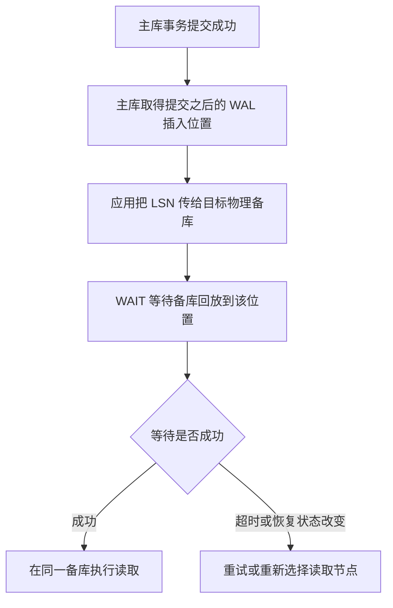

# PostgreSQL 19: What to Expect from the Upcoming Release

> 专题解读 · Mydbops MyWebinar #55 · 复制、校验与升级<br>
> 基于 Pranav Ghotekar（Mydbops）的同名分享整理，分享于 2026-09-25。<br>
> 中文整理与技术校订：xiongcc。

表膨胀了，想回收空间，却很难安排停机窗口；autovacuum 一直在跑，维护任务仍然积压；应用刚写完主库，下一次读备库却看不到结果。这些问题并不新鲜，处理起来往往需要数据库、应用和运维工具一起配合。

PostgreSQL 19 给这些工作增加了新的工具。不过，收益出现的地方并不相同：有的缩短维护时的锁定窗口，有的只加快清理过程中的一部分，还有的需要应用主动配合。评估升级时，值得关心的是自己原来的处理流程会在哪一步发生变化。

本文按 **2026-09-30 的 PostgreSQL 19 Beta 4 状态**整理，并结合官方文档补充原材料中的使用条件。19 尚未正式发布；官方预计 10 月进入候选发布阶段，正式发布日期取决于测试结果。以下内容用于理解和评估新版本，生产升级仍应以正式版为准。

## REPACK：回收空间时，业务可以继续读写

普通 VACUUM 清理旧行版本后，空闲空间通常留给表后续使用。要把膨胀占用的空间充分归还操作系统，往往需要重写表。以前选择 `VACUUM FULL`，就得接受较长时间的排他锁；需要在线整理时，很多环境会借助 `pg_repack` 等扩展。

PostgreSQL 19 增加内置 `REPACK` 命令。默认方式重写表并回收空间，指定 `USING INDEX` 则可以按索引组织物理顺序。对于符合条件的表，可以使用并发模式：

```sql
REPACK (CONCURRENTLY) public.orders;
```

这里假设 `orders` 是已有的普通持久化表，使用默认的 heap 存储方式，并有主键或基于索引的复制标识。复制标识用于定位发生 UPDATE、DELETE 的行；重整期间的变化要应用到新数据中，因此需要能够识别这些行。命令应在事务块之外执行，执行用户需要相应维护权限。

可以把执行过程看成三段。开始时，业务仍然使用旧表，REPACK 将有效数据复制到新文件，并建立新索引。复制过程中，订单可能继续新增、修改和删除；这些变化通过逻辑解码从 WAL 中提取出来，再应用到新文件。追赶完成后，数据库才把访问切换到整理后的文件。

这也解释了并发模式为什么能缩短锁定窗口：耗时较长的数据复制和索引构建允许业务继续访问旧表，最后切换文件时才取得阻止读写的 `ACCESS EXCLUSIVE` 锁。如果等待这把锁期间又积累了大量变更，取得锁后还要处理它们，业务暂停时间就可能延长。

准备采用它时，优先观察两件事：新旧表及索引同时存在时，磁盘是否放得下；写入持续发生时，重整能否追赶上并完成切换。排序和增量暂存还会消耗空间，因此应在磁盘耗尽之前安排维护。演练时除了记录完成时间，还要记录峰值空间、锁等待和业务请求延迟，并避开针对目标表的并发 DDL。

**适用范围。** 当前并发模式不支持直接对分区父表执行，也不适用于 unlogged 表、物化视图或缺少合适复制标识的表。分区表需要按叶子分区检查和安排。

**长事务还要检查快照。** 快照决定一次读取能够看见哪些行版本。假设一个事务已经取得快照、读取了其他表，但还没访问订单表；订单表此时完成并发重整，这个事务再按旧快照查询订单表，可能看到空表。数据并没有被删除，而是重写后的可见性与旧快照不兼容。涉及跨表一致性读取、长时间持有快照的业务，演练时要覆盖这一场景。

## Autovacuum：索引可以并行清理，任务也有了优先级

VACUUM 一张表时，除了扫描表数据，还需要处理索引中指向无用行版本的条目。一张表有多个大索引时，索引清理可能占掉相当一部分时间。PostgreSQL 19 允许 autovacuum 为索引清理申请并行 worker，也就是额外的后台工作进程，让不同索引的部分工作可以同时进行。

这一能力作用于 **index vacuuming 和 index cleanup 阶段**。表数据的扫描以及其余工作仍需执行，所以应该先通过 `pg_stat_progress_vacuum` 的阶段观察和维护日志，判断耗时是否集中在索引上。

全局参数 `autovacuum_max_parallel_workers` 控制单个 autovacuum worker 可使用的并行 worker 数量，表级参数 `autovacuum_parallel_workers` 可以覆盖它。当前默认全局值为 `0`，需要主动启用；实际可用数量还受到 `max_parallel_workers` 等资源限制。优先选一张索引清理耗时明显的表做对照，比较相近写入负载下的清理时长、存储负载和业务延迟，比直接全局调大更容易判断收益。

例如一张表有四个大索引，过去逐个处理，现在有机会同时处理其中几个。能节省多少时间，取决于索引阶段占比及可用资源。若存储已经繁忙，多个 worker 仍要竞争同一块设备；若时间主要耗在表扫描或等待上，索引并行能缩短的只是很小一部分。

另一个变化解决“先处理哪张表”。事务编号逐渐老化、死元组积累、插入后需要维护、统计信息需要更新，都可能让一张表更急需处理。新的评分机制将这些需求纳入调度，`pg_stat_autovacuum_scores` 则提供了查看各表评分的入口。多张表等待维护时，可以据此理解处理次序，而不只看谁最近没有被清理过。

评分能改善排队次序，并行能加快特定阶段；旧快照保留的行版本仍然不能提前删除。排障时依旧应区分“清理不了”“轮不到”和“执行得慢”。这些区别可以结合[《Autovacuum 为什么跟不上》](/docs/102.md)一起看。

## 逻辑复制补上序列同步，但切换前仍要核对

通过逻辑复制迁移数据库时，表里的自增 ID 可以随着 INSERT 复制过去，负责生成下一个 ID 的序列却单独保存状态。假设订单表已经复制到了 ID 10000，目标端的序列却仍准备从 501 开始取号；501 这条订单如果已经存在，新写入就会遇到主键冲突。两端表数据一致，并不能说明它们准备发出的下一个号码也一致。

PostgreSQL 19 允许发布序列，并在创建订阅时复制初始值。对已有订阅，可以显式重新同步已知序列：

```sql
ALTER SUBSCRIPTION orders_sub REFRESH SEQUENCES;
```

`orders_sub` 需要是已订阅相关序列的订阅，两端序列定义也要满足同步要求。该命令启动同步工作，不能仅凭语句返回就认定所有序列已经追平。

同步由专门的 worker 完成，结束后它就退出。**发布端继续调用 `nextval()` 取号，两端序列值仍会再次产生差异。** 这项功能提供了内置的初始同步和显式刷新手段，最终切换前仍需安排最后一次同步。

对于计划内迁移，这项能力减少了手写同步脚本的工作，但最终切换仍需停止源端写入和取号，等待表数据追平，完成序列同步及核对，再开放目标端写入。发布端必须是 PostgreSQL 19 或更高版本，不能直接套用到所有旧版本迁往 19 的场景。

## 启用逻辑解码，可以少安排一次重启

WAL 记录多少信息，由 `wal_level` 决定。物理复制可以使用 `replica` 级别；逻辑解码要还原行级变化，需要更多信息，也就是 `logical` 级别。过去实例未提前配置后者时，为了启用逻辑复制，往往还要协调一次重启。

PostgreSQL 19 在 `wal_level=replica` 的条件下，可以根据逻辑复制槽自动调整实际记录级别：创建第一个逻辑槽时提升为 `logical`，删除或失效最后一个逻辑槽后降回 `replica`。`effective_wal_level` 用来查看实际状态，原来的配置值则可以保持不变。

这让临时迁移、CDC 等任务更容易开始。准备工作应转向检查可用复制槽、WAL sender、权限，以及槽保留 WAL 的空间风险；如果这些资源参数本身不足，仍可能需要调整甚至重启。新的记录级别只影响之后生成的信息，不会补出旧 WAL 中没有记录的内容。

另外，订阅端的 `retain_dead_tuples` 可以保留部分冲突检测所需的信息，适用于更专门的复制拓扑。它会影响旧版本清理，普通单向迁移无需默认启用。需要使用时，应单独评估保留范围和停用订阅后的清理策略：订阅停用或 apply worker 不运行时，保留时长限制也不会自动完成到期清理。

## WAIT：在备库查询之前，等自己的写入回放完成

读写分离中的一个常见问题是，主库已经返回提交成功，备库还没有回放到那个位置。应用如果马上把查询发给备库，就可能读到旧数据。过去可以回主库读取，或者在应用里轮询备库回放位置。

PostgreSQL 19 提供 `WAIT FOR LSN`，让数据库直接等待指定 WAL 位置。LSN 可以理解为 WAL 中的位置标记，备库回放到这个标记，意味着对应位置之前的变更已处理到那里。实现“读到自己刚才的写入”时，流程如下：



主库上，在目标事务成功提交之后取得一个位置：

```sql
SELECT pg_current_wal_insert_lsn();
```

这里取得的是包含目标提交记录之后的位置，可能也包含其他并发事务的 WAL。它不一定恰好是该事务的提交 LSN，但可以作为等待目标。若在 `COMMIT` 之前取值，可能没有覆盖提交记录，不能用于这个保证。

应用将实际取得的 LSN 传给物理备库。下面的位置仅作语法示例：

```sql
WAIT FOR LSN '0/0306EE20'
WITH (MODE 'standby_replay', TIMEOUT '5s');
```

等待成功后，再在同一备库执行查询。`standby_replay` 等的是回放完成；仅等待接收、写入或刷盘，还不足以让查询看到相应行版本。`WAIT` 应在事务块之外，或作为事务中尚未取得锁和快照的第一条语句执行，不能先拿着旧快照读取，再指望等待更新这个快照。

超时默认会报错。使用 `NO_THROW` 可以改为返回状态，但应用必须检查结果，不能超时后继续按“已经追平”处理。这个接口也不负责理解复制时间线；主备切换后，应用需要重新判断目标节点和 LSN 的有效性。它针对物理备库的 WAL 进度，不能拿来直接等待另一套逻辑订阅的应用进度。

这给应用提供了更精确的选择：只有需要立即读到刚才写入的请求才等待，其余请求仍按原有读写分离策略处理。等待会增加这类读取的延迟，备库落后严重时，超时与回退策略仍由业务决定。

## Plan advice：让优化器尝试另一条路径

升级、统计信息变化或参数调整之后，同一条 SQL 可能换一种连接顺序或扫描方式。有时新计划很好，有时却出现明显回退。定位时，经常需要回答一个具体问题：如果保留原来的连接顺序，是否真的更快？

`pg_plan_advice` 用一套 advice 描述扫描方式、连接方法、连接顺序和并行选择。加载模块后，`EXPLAIN (PLAN_ADVICE)` 可以显示这些决策，再选取需要的部分进行干预。

用一张有索引的小表更容易看出作用。以下示例只用于独立实验库，需要已安装 `pg_plan_advice` 模块，并使用有权 `LOAD` 模块的用户。在同一个会话中建立临时表，填入十万行：

```sql
LOAD 'pg_plan_advice';
CREATE TEMP TABLE advice_demo AS
SELECT g AS id, repeat('x', 80) AS payload
FROM generate_series(1, 100000) AS g;
CREATE INDEX advice_demo_id_idx ON advice_demo(id);
ANALYZE advice_demo;

EXPLAIN (COSTS OFF, PLAN_ADVICE)
SELECT payload FROM advice_demo AS d WHERE id = 42;
```

在本次 PostgreSQL 19beta4 隔离实验中，得到以下计划：

```text
Index Scan using advice_demo_id_idx on advice_demo d
  Index Cond: (id = 42)
Generated Plan Advice:
  INDEX_SCAN(d pg_temp.advice_demo_id_idx)
  NO_GATHER(d)
```

查询只需要一行，优化器选择了索引扫描。后面的 `Generated Plan Advice` 是对这个计划的描述：使用指定索引，不采用 Gather 并行汇总。接着，给优化器一个明确要求，让别名为 `d` 的这次表访问使用顺序扫描：

```sql
SET pg_plan_advice.advice = 'SEQ_SCAN(d)';
EXPLAIN (COSTS OFF)
SELECT payload FROM advice_demo AS d WHERE id = 42;
RESET pg_plan_advice.advice;
```

这一次，输出变为：

```text
Seq Scan on advice_demo d
  Filter: (id = 42)
Supplied Plan Advice:
  SEQ_SCAN(d) /* matched */
```

`Seq Scan` 表明扫描方式已经改变，`matched` 则说明这条 advice 匹配到了目标。`SEQ_SCAN(d)` 中的 `d` 对应查询里的表别名。它约束的是这次表访问的方式，优化器仍负责生成合法的执行计划。执行 `RESET` 后再次查看计划，实验中恢复了索引扫描；临时表会在会话结束后清理。

这个例子刻意要求顺序扫描，用来观察干预是否生效，而非推荐对单行查找这样优化。实际诊断时，可以用同样方法对照扫描方式或连接顺序，再用 `EXPLAIN (ANALYZE, BUFFERS)` 比较读取量与执行时间。还要看 advice 的匹配反馈：别名错误、索引不存在或要求的路径不可行时，计划可能并未按要求生成。

配套的 `pg_stash_advice` 可以保存 advice，并根据查询标识自动应用，适合将已验证的选择用于指定查询。上面的会话级例子并没有配置这部分持久管理功能。

固定某些规划决策也会限制优化器适应数据变化。今天选择性很高的条件，几个月后可能已经覆盖大部分数据，原来的索引扫描就未必合适。生产中保留 advice 时，最好同时留下使用原因、对照结果和撤销条件，避免一次应急处理长期无人维护。

## 升级评估别漏掉默认行为变化

新功能通常会专门测试，已有配置却容易被原样带过去。材料列出的几项默认值和兼容性变化，值得放进升级演练清单：

| 变化 | 升级时检查什么 |
| --- | --- |
| JIT 默认关闭 | 有明显 JIT 收益的分析查询，需要比较开启与关闭时的表现；不要从版本号推断实际会话配置 |
| 构建支持 LZ4 时，TOAST 默认使用 LZ4；否则仍为 pglz | 检查列级压缩设置和空间表现；更改默认值不会自动重压缩全部存量值 |
| `max_locks_per_transaction` 默认从 64 改为 128 | 锁空间分配方式也变化；按发行说明，保持旧版容量需要将设置值翻倍，已有自定义值应重新核算 |
| `standard_conforming_strings` 固定为开启 | 排查依赖旧转义行为的应用，以及在该参数关闭时生成的旧 dump |
| 移除 RADIUS 认证 | 仍使用 RADIUS 的环境要先规划替代认证方式 |
| 调整 `inet` / `cidr` 的 GiST 操作符类 | 检查受影响的 `btree_gist` 索引及升级前置检查；不是把所有普通 B-tree 索引改成 GiST |

最后一项针对 `btree_gist` 的网络地址类型操作符类，即索引如何处理这类值的比较。已有相关索引的环境需要检查升级限制，普通 B-tree 索引不因此整体转换为 GiST。

升级演练仍应使用业务 SQL、已有索引和真实配置。只在全新实例里建几张表，往往碰不到旧参数、扩展和导出文件带来的兼容问题。

## 有些早期预告已经撤回

Beta 期间的功能清单仍会变化。官方 Beta 3 公告撤回了自动推导分组项的 `GROUP BY ALL` 新功能；Beta 4 又撤回了 SQL/PGQ、在线启停数据校验和、`FOR PORTION OF` 时态更新删除，以及分区合并与拆分。

如果升级计划依赖这些能力，需要重新选择实现方案。早期预告可以了解开发方向，可用功能应按后续公告和目标版本确认；被撤回的实现能否进入下一版，也仍待开发与评审。

## 先检查兼容性，再挑最需要的新能力

**准备升级的环境，都要先检查默认值、认证和已有对象的兼容性。** 这些变化即使不使用新命令也可能遇到。原配置中显式设置过的参数、扩展和迁移方式，要和新实例默认值分开核对。

其余能力可以按实际问题选择，评估顺序不必和功能清单一致：

| 当前问题 | 需要谁配合或主动启用 | 优先观察什么 |
| --- | --- | --- |
| 表膨胀，难安排长时间停写 | DBA 对指定表执行并发 REPACK | 峰值磁盘空间、增量追赶、切换锁和请求延迟；覆盖旧快照场景 |
| autovacuum 清理周期过长 | DBA 先定位阶段，再启用索引并行 | 索引阶段占比、可用 worker、存储竞争，以及前台请求是否受影响 |
| 逻辑迁移后要接管写入 | DBA 把序列同步加入切换流程 | 源端停止取号后，同步是否完成、目标端下一次取号是否与已有数据冲突 |
| 异步备库读不到刚才的写入 | 应用或连接路由层传递 LSN、处理等待结果 | 有多少请求需要等待、延迟增加多少、超时后是否能正确回退 |
| 某条 SQL 的执行计划回退 | DBA 验证 advice，必要时再配置保存与应用 | advice 是否匹配，读取量和耗时是否改善，以及何时撤销干预 |

例如，业务没有读写分离，就不必因为新增 WAIT 而调整应用；清理时间主要花在表扫描上，也可以暂缓索引并行的配置。把精力放到当前最费时、最难安排的工作上，才能看出升级是否真正改善了维护和使用体验。

## 参考资料

- 原分享：Pranav Ghotekar，*PostgreSQL 19: What to Expect from the Upcoming Release*，Mydbops MyWebinar #55，2026-09-25。[活动页面](https://www.meetup.com/mydbops-database-meetup/events/316578787/)、[Mydbops Webinar 入口](https://www.mydbops.com/webinars)。
- 版本状态：[PostgreSQL 19 Beta 4 公告](https://www.postgresql.org/about/news/postgresql-19-beta-4-released-3386/)、[Beta 3 公告](https://www.postgresql.org/about/news/postgresql-186-1711-1615-1519-1424-and-19-beta-3-released-3365/)、[PostgreSQL 19 发行说明](https://www.postgresql.org/docs/19/release-19.html)。
- 表维护：[REPACK](https://www.postgresql.org/docs/19/sql-repack.html)、[MVCC 与表重写](https://www.postgresql.org/docs/19/mvcc-caveats.html)、[Vacuum 参数](https://www.postgresql.org/docs/19/runtime-config-vacuum.html)、[日常 Vacuum 与调度](https://www.postgresql.org/docs/19/routine-vacuuming.html)。
- 复制：[序列同步](https://www.postgresql.org/docs/19/logical-replication-sequences.html)、[WAL 配置](https://www.postgresql.org/docs/19/runtime-config-wal.html)、[CREATE SUBSCRIPTION](https://www.postgresql.org/docs/19/sql-createsubscription.html)、[WAIT](https://www.postgresql.org/docs/19/sql-wait.html)。
- 计划管理：[pg_plan_advice](https://www.postgresql.org/docs/19/pgplanadvice.html)、[pg_stash_advice](https://www.postgresql.org/docs/19/pgstashadvice.html)。
- 升级细节：[默认 TOAST 压缩](https://www.postgresql.org/docs/19/runtime-config-client.html#GUC-DEFAULT-TOAST-COMPRESSION)、[btree_gist](https://www.postgresql.org/docs/19/btree-gist.html)。
