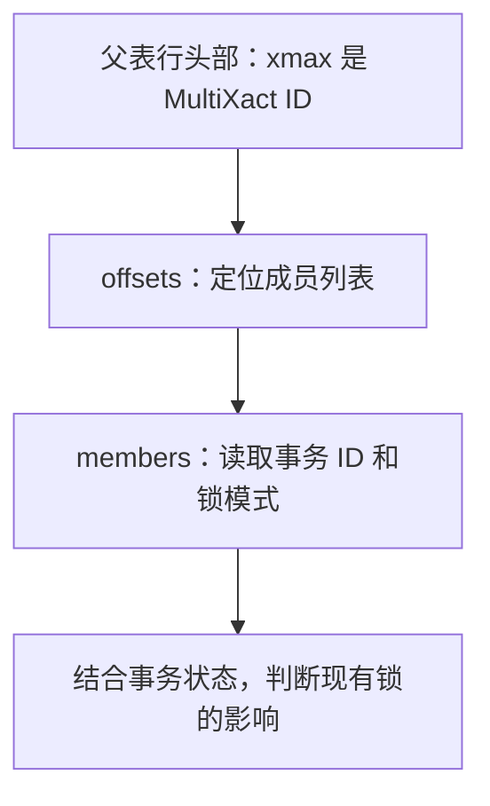

# All Your GUCs in a Row: multixact_member_buffers and multixact_offset_buffers

本文基于 Christophe Pettus 在 The Build 发布的 MultiXact 缓存文章，结合 PostgreSQL 文档、源码与一个最小实验，讨论外键写入、MultiXact 和长事务之间的关系。中文解读与技术校订：xiongcc。

假设有一套订单系统：后台正在批量导入订单，线上也不断产生新订单。订单表的外键指向客户表，客户主键索引齐全，插入语句看起来也很简单，但批量任务运行期间，线上写入明显变慢。

查执行计划没有发现大范围扫描，业务锁等待也不突出。这个时候，还可以检查外键校验留下的行锁，以及 PostgreSQL 为这些锁维护的 MultiXact 记录。

这里值得关注的地方是：**即使两个事务的行锁互相兼容，记录和读取这些锁的过程仍然有成本。** 长事务会让这部分成本持续影响其他写入。

## 插入订单，为什么会锁住客户记录？

考虑两张表：`customers` 保存客户，`orders.customer_id` 通过外键引用 `customers.id`。

普通的非延迟外键校验除了确认客户存在，还需要保证：订单事务尚未结束时，其他事务不能删除该客户，也不能把被引用的键改掉。为此，PostgreSQL 会在对应的父表行上取得 `FOR KEY SHARE` 行锁。

这个锁允许其他事务同时检查并引用同一位客户。因此，事务 A 和 B 各自插入一张订单，可以同时持有同一客户行的 `KEY SHARE` 锁，不需要等对方提交。但数据库仍然要记住谁在持锁，才能正确处理后续的删除、更新和加锁请求。

行版本头部的 `xmax` 字段参与记录这些信息。只有一个持锁事务时，它可以记录事务 ID；需要表达多个事务的锁状态时，它可以记录一个 **MultiXact ID**，通过这个编号查到成员事务及其锁模式。

这也解释了为什么看到非零 `xmax`，不能立即认定这一行已被删除：它的含义还取决于行头部的标志位。

在本文的普通事务示例中，父表行锁一直保持到事务提交或回滚。SQL 已经执行完、连接处于 `idle in transaction`，都不会自动结束这个事务。

## MultiXact 记录放在哪里？

MultiXact 的成员数不固定，全部塞进一行的头部显然不合适。PostgreSQL 把记录保存在数据目录的 `pg_multixact` 下，分成两部分：

- `offsets`：根据 MultiXact ID 找到成员列表的起始位置。
- `members`：保存成员的事务 ID 和锁模式。

读取一条需要解析的 MultiXact 时，大致经过下面的路径：



这两部分各有一个共享内存缓存，属于 **SLRU**。在这里，可以把 SLRU 理解为 PostgreSQL 专门缓存事务辅助记录的小型页缓存；它和缓存表、索引页面的 `shared_buffers` 分开管理。

PostgreSQL 17 开始允许配置它们的大小。17、18 的默认值分别是：

| 参数 | 缓存对象 | 默认页数 | 按 8 KB 页计算的容量 |
| --- | --- | --- | --- |
| `multixact_offset_buffers` | MultiXact 的成员位置 | 16 | 128 KB |
| `multixact_member_buffers` | 成员事务与锁模式 | 32 | 256 KB |

这两个默认值不会随着 `shared_buffers` 增大而自动增长。即使表和索引都已经缓存在内存里，访问 MultiXact 时仍可能遇到另一组缓存的容量限制。

不过，数据库产生过多少 MultiXact，并不直接决定需要多大的缓存。真正影响当前开销的是：正在执行的事务还需要访问哪些记录，这些记录分布在多少页面上。

## 长事务怎样改变访问范围？

对于只记录行锁的旧 MultiXact，PostgreSQL 有一条跳过成员读取的路径：如果根据活动事务的 MultiXact 边界，能够确定其中已经不可能存在仍有效的持锁事务，就不必再读取旧成员列表。

短事务不断结束时，这条边界能向前推进。父表行上即便还留着旧编号，后续事务也往往无需解析那份锁记录。

现在把事务 A 换成一个批量任务：它在一个事务中插入许多订单，涉及大量客户，完成后迟迟没有提交。A 会在这些客户行上一直保持外键校验取得的锁。

如果线上事务 B 又为其中一位客户插入订单，就需要记录 A 和 B 同时持锁。B 提交后，A 仍在；事务 C 再次引用这位客户时，需要读取之前的成员信息，识别仍有效的 A，并形成包含 A、C 的锁记录。

**这里的成员变化会产生新的 MultiXact，而不是把旧成员列表直接改写。** 各个客户行上最后留下的编号取决于它最近一次被哪些事务访问，因而可能指向不同位置的记录。

把这个过程扩展到大量客户行，新的访问就可能分散到许多 `offsets`、`members` 页面。缓存放不下时，旧页被换出，下一次引用又需要读回来。

因此，判断这种问题要同时看长事务保持了多久、锁住了多少父表行，以及其他事务是否持续引用这些行。一个很老但没有参与相关行锁的事务，和一个覆盖大量客户的外键批量写入任务，对这条路径的影响并不相同。

## 用三笔订单观察成员变化

下面的例子使用 PostgreSQL 18.4、默认 `READ COMMITTED` 隔离级别。在专用测试库中打开四个 `psql` 窗口，分别作为会话 A、B、C 和观察会话。四个窗口连接同一个库，观察会话保持默认的自动提交，不执行 `BEGIN`。

可以用 `psql -X -P pager=off -d 你的测试库名` 连接，按环境补上 `-h`、`-p`、`-U`。`-X` 避免本机 psql 配置影响例子。以下包含 psql 的 `\gset` 命令，整段在 psql 中执行。

下面的输出来自本次运行。其他实例的事务 ID 和 MultiXact ID 可能不同，比较它们的对应关系即可；观察查询会读取实际编号。

### 建表和准备数据

在观察会话执行。使用独立的 `mx_demo` schema；如果这个名称已经存在，请换一个空测试库，不要覆盖原有对象。

<!-- verify:setup -->
```sql
CREATE SCHEMA mx_demo;

CREATE TABLE mx_demo.customers (
    id integer PRIMARY KEY,
    name text NOT NULL
);

CREATE TABLE mx_demo.orders (
    id integer PRIMARY KEY,
    customer_id integer NOT NULL REFERENCES mx_demo.customers(id),
    amount numeric(10, 2) NOT NULL
);

INSERT INTO mx_demo.customers VALUES (1, 'Alice'), (2, 'Bob');

SELECT id, name, xmax
FROM mx_demo.customers
ORDER BY id;
```

<!-- result:setup -->
```text
id | name  | xmax
----+-------+------
  1 | Alice |    0
  2 | Bob   |    0
(2 rows)
```

后面的订单都引用 Alice；Bob 用来对照没有参与外键校验的父表行。这里使用的 `xmax` 是 PostgreSQL 的系统列，不是建表时添加的业务字段。

### A 插入订单，保持事务打开

在会话 A 执行，暂不提交：

<!-- verify:a -->
```sql
SET application_name = 'mx_demo_A';
BEGIN;
INSERT INTO mx_demo.orders VALUES (100, 1, 100.00);
SELECT pg_current_xact_id() AS xid_a;
```

<!-- result:a -->
```text
xid_a
-------
   756
(1 row)
```

回到观察会话，读取父表行：

<!-- verify:observe-a -->
```sql
SELECT id, name, xmax
FROM mx_demo.customers
ORDER BY id;
```

<!-- result:observe-a -->
```text
id | name  | xmax
----+-------+------
  1 | Alice |  756
  2 | Bob   |    0
(2 rows)
```

Alice 行的 `xmax` 此时记录 A 的事务 ID。仅凭这个数字不能把它当成 MultiXact ID，下面要等 B 也取得锁，再查询成员。

### B 插入第二笔订单，查询成员列表

在会话 B 执行，也暂不提交：

<!-- verify:b -->
```sql
SET application_name = 'mx_demo_B';
BEGIN;
INSERT INTO mx_demo.orders VALUES (101, 1, 200.00);
SELECT pg_current_xact_id() AS xid_b;
```

<!-- result:b -->
```text
xid_b
-------
   757
(1 row)
```

这条插入可以完成，因为 A、B 在父表行上的 `KEY SHARE` 锁相互兼容。

在观察会话执行：

<!-- verify:observe-ab -->
```sql
SELECT id, name, xmax
FROM mx_demo.customers
ORDER BY id;

SELECT xmax::text AS mx_ab
FROM mx_demo.customers
WHERE id = 1
\gset

SELECT xid, mode
FROM pg_get_multixact_members(:'mx_ab'::xid)
ORDER BY xid::text::bigint;
```

<!-- result:observe-ab -->
```text
id | name  | xmax
----+-------+------
  1 | Alice |    1
  2 | Bob   |    0
(2 rows)

 xid | mode
-----+-------
 756 | keysh
 757 | keysh
(2 rows)
```

Alice 的 `xmax` 现在是 MultiXact ID 1，它的两个成员分别对应 A、B。Bob 的记录没有变化。

`\gset` 把这次读到的编号存入观察会话的 `mx_ab` 变量，后续可以再次查询同一份记录。`keysh` 是函数返回的锁模式名称，对应 `FOR KEY SHARE`。事务 ID 和 MultiXact ID 是两套编号；这里根据前面的操作过程确认 `xmax` 的含义，而非比较数字大小。

### B 提交，C 再插入一笔订单

先在会话 B 执行：

<!-- verify:b-commit -->
```sql
COMMIT;
```

让 A 继续保持打开，再在会话 C 执行：

<!-- verify:c -->
```sql
SET application_name = 'mx_demo_C';
BEGIN;
INSERT INTO mx_demo.orders VALUES (102, 1, 300.00);
SELECT pg_current_xact_id() AS xid_c;
```

<!-- result:c -->
```text
xid_c
-------
   758
(1 row)
```

回到同一个观察会话，同时查看当前编号和之前保存的编号：

<!-- verify:observe-ac -->
```sql
SELECT c.id, c.xmax, m.xid, m.mode
FROM mx_demo.customers AS c
CROSS JOIN LATERAL pg_get_multixact_members(c.xmax) AS m
WHERE c.id = 1
ORDER BY m.xid::text::bigint;

SELECT xid, mode
FROM pg_get_multixact_members(:'mx_ab'::xid)
ORDER BY xid::text::bigint;
```

<!-- result:observe-ac -->
```text
id | xmax | xid | mode
----+------+-----+-------
  1 |    2 | 756 | keysh
  1 |    2 | 758 | keysh
(2 rows)

 xid | mode
-----+-------
 756 | keysh
 757 | keysh
(2 rows)
```

当前编号已经变成 2，成员是 A、C；之前保存的编号 1 仍然对应 A、B。旧列表没有被原地改写。这里也能看到，函数返回的是记录中的成员，并不自动过滤已经结束的事务；B 出现在旧列表中，不代表它还在持锁。

第一条查询读取 Alice 行当前的成员，第二条读取 A、B 同时持锁时的记录。这里只对已确认使用 MultiXact 的 Alice 行调用函数，不把 Bob 的 `xmax = 0` 或普通事务 ID 传进去。

### 提交并核对数据

在会话 C、A 中分别执行一次：

<!-- verify:finish -->
```sql
COMMIT;
```

随后在观察会话执行：

<!-- verify:final -->
```sql
SELECT id, customer_id, amount
FROM mx_demo.orders
ORDER BY id;

SELECT id, name, xmax
FROM mx_demo.customers
ORDER BY id;
```

<!-- result:final -->
```text
id  | customer_id | amount
-----+-------------+--------
 100 |           1 | 100.00
 101 |           1 | 200.00
 102 |           1 | 300.00
(3 rows)

 id | name  | xmax
----+-------+------
  1 | Alice |    2
  2 | Bob   |    0
(2 rows)
```

三笔订单都已提交，但 Alice 行的 `xmax` 仍然是 2。事务结束释放了锁，不要求立即改写每个曾经加锁的行头部。后续访问会结合事务状态判断这些成员是否仍有效；不能单凭非零 `xmax` 判断一行还被锁住。

这个例子用于观察兼容行锁和成员集合的变化，不需要制造大量负载。大工作集下的 SLRU 读取和内部锁竞争，还要结合后面的监控方法判断。

完成后，确认 A、B、C 都已经提交或回滚，再在观察会话删除本例对象：

<!-- verify:cleanup -->
```sql
DROP SCHEMA mx_demo CASCADE;
```

## 扩大缓存，还会改变内部锁的竞争

读取缓存中的 MultiXact 页面，也需要保护缓存自身的并发访问。这一层使用的是 PostgreSQL 内部轻量级锁，与前面客户行上的业务行锁不同。

从 PostgreSQL 17 开始，SLRU 缓存以每 16 页为一组划分为多个 bank，各组有自己的锁。页面按照页号对 bank 数量取模，分配到对应组；MultiXact 的相关读取路径会取得该组的排他锁。

默认的 16 页 `offsets` 缓存只有一个 bank。增大页数后，既能容纳更多页面，也会增加 bank 数量，让落在不同组的访问有机会并发进行。

这不意味着每个请求都能获得独立的锁。同一页面仍然落在同一组，访问还涉及其他共享状态。缓存增大能改善哪一部分，要根据实际等待来判断。

Pettus 在原文中用一个长期未提交、覆盖大量父表行的事务，叠加多个客户端随机插入子表的负载，对比了默认与扩大后的缓存。扩大后，SLRU 读取次数下降，插入吞吐也有改善。这组结果与上述访问路径相符；本文的小实验则用于观察成员变化，不承担吞吐测试的作用。

## 怎样判断自己的系统是否遇到了这个问题？

可以从 `pg_stat_slru` 看起。下面的查询适用于 PostgreSQL 17、18 的名称：

<!-- verify:slru -->
```sql
SELECT name, blks_hit, blks_read, blks_written, stats_reset
FROM pg_stat_slru
WHERE name IN ('multixact_offset', 'multixact_member')
ORDER BY name;
```

这些是实例级累计计数。应该在写入变慢的时间段采样，比较两次之间的增量，同时确认 `stats_reset` 没有变化。在自动提交模式下分开执行两次查询即可；不要把监控采样长期放在同一个事务里，以免读到缓存的统计快照。

`blks_read` 增长表示需要从 SLRU 文件读取页面，不能直接换算成物理磁盘读取次数：文件可能已经在操作系统页缓存里。即便如此，额外的读取路径和并发协调仍有成本。冷启动时少量读取很正常，单次看到非零值不足以判断缓存偏小。

如果写入变慢时这两行的读取增量明显增大，再结合 `pg_stat_activity` 观察 `MultiXactOffsetSLRU`、`MultiXactMemberSLRU` 等等待，以及事务开始时间：

<!-- verify:activity -->
```sql
SELECT pid,
       now() - xact_start AS xact_age,
       state,
       wait_event_type,
       wait_event,
       query
FROM pg_stat_activity
WHERE backend_type = 'client backend'
  AND pid <> pg_backend_pid()
  AND xact_start IS NOT NULL
ORDER BY xact_start;
```

这条查询帮助定位长时间打开的客户端事务。查看其他用户会话的完整信息，需要相应的监控权限，例如 `pg_read_all_stats`。

`query` 显示的当前或最近一条语句，未必是事务前面取得行锁的那条 SQL，还需要结合应用日志、批处理任务及事务边界确认。内部等待出现得很短，单次采样也可能错过，可以在问题持续期间多次观察。

如果 SLRU 读取基本不增长，相关等待也没有集中出现，就没有充分依据把这两个参数当成当前瓶颈。外键查询是否有效利用索引、是否存在冲突行锁，仍然值得分别检查。

## 处理时，把事务模式和缓存一起考虑

对于覆盖大量父表行的批量写入，值得优先评估能否拆成较小的提交批次。事务更早结束，可以更早释放父表行锁，让其他事务不必持续处理同一批仍有效的锁成员。

拆分会改变原子性、失败重试和业务可见性。业务确实需要整体提交时，就要在批处理时间、并发程度和缓存容量之间选择，不能只为了缩短事务破坏原有一致性要求。

有了 SLRU 读取和等待的证据后，再评估 `multixact_offset_buffers`、`multixact_member_buffers`。这两个参数需要在服务器启动时生效，页数必须是 16 的倍数；修改前应核对内存预算并安排重启窗口。

容量选择要看问题时间段内活跃访问的页面范围、MultiXact 产生速度和成员数量。扩大后的对照也应保持相近负载，比较 SLRU 读取增量、内部等待、请求延迟和吞吐，不能只盯缓存命中率。

升级 PostgreSQL 19 时，还需要重新看 `offsets` 的容量。19 将成员位置的偏移值从 32 位扩展到 64 位；按 8 KB 页面计算，每页可容纳的偏移项由 2,048 个降为 1,024 个。同样的缓存页数，能覆盖的偏移项减少了一半。

这一变化值得已有调优配置的系统在升级测试中重点检查，但不必据此把所有实例的参数机械翻倍。成员页布局没有同样的变化，而 MultiXact ID 本身也仍是 32 位，扩展的是成员偏移值。

外键写入变慢时，除了检查索引是否找得快，还可以继续追问：父表行上的锁保持了多久，其他事务正在反复访问哪些锁记录？把这两件事查清楚，才能判断该调整批处理事务、缓存，还是继续寻找别处的瓶颈。

## 延伸阅读

- [SQL 很快，事务却在排队：PostgreSQL OLTP 锁竞争](/docs/104.md)
- [Autovacuum 为什么跟不上：清理受阻、任务积压与执行缓慢](/docs/102.md)

## 参考资料

- 原文：Christophe Pettus，[All Your GUCs in a Row: multixact_member_buffers and multixact_offset_buffers](https://thebuild.com/blog/all-your-gucs-in-a-row-multixact_member_buffers-and-multixact_offset_buffers/)，2026-10-04。
- 行锁与外键校验：[Explicit Locking](https://www.postgresql.org/docs/18/explicit-locking.html#LOCKING-ROWS)、[ri_triggers.c](https://github.com/postgres/postgres/blob/REL_18_STABLE/src/backend/utils/adt/ri_triggers.c)。
- 缓存参数与版本变化：[Resource Consumption](https://www.postgresql.org/docs/18/runtime-config-resource.html)、[PostgreSQL 17 Release Notes](https://www.postgresql.org/docs/17/release-17.html)。
- 监控与实验函数：[The Cumulative Statistics System](https://www.postgresql.org/docs/18/monitoring-stats.html)、[System Information Functions](https://www.postgresql.org/docs/18/functions-info.html)。
- psql 变量与命令：[psql](https://www.postgresql.org/docs/18/app-psql.html)。
- MultiXact 与 SLRU 实现：[multixact.c](https://github.com/postgres/postgres/blob/REL_18_STABLE/src/backend/access/transam/multixact.c)、[slru.c](https://github.com/postgres/postgres/blob/REL_18_STABLE/src/backend/access/transam/slru.c)。
- PostgreSQL 19：[Widen MultiXactOffset to 64 bits](https://github.com/postgres/postgres/commit/bd8d9c9bd)。
