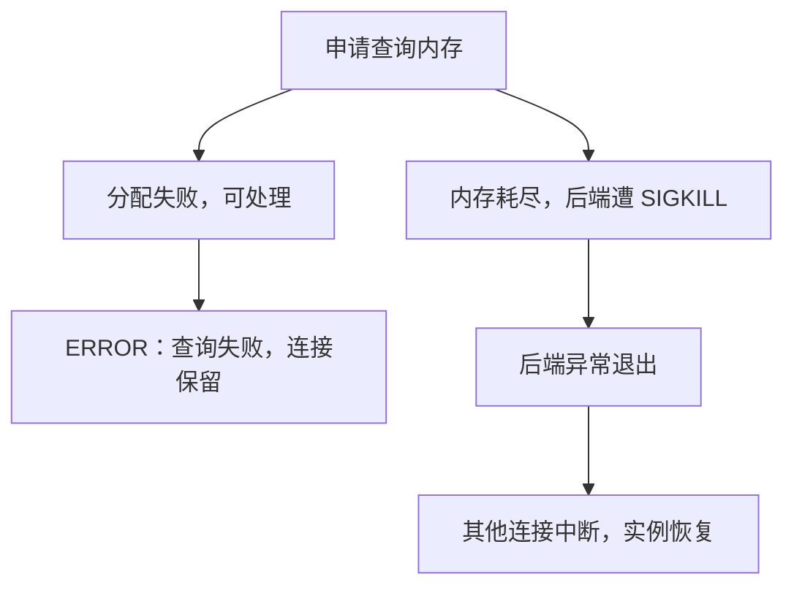

# Can your Postgres survive a bad query?

本文由 Kevin Biju Kizhake Kanichery 于 2026 年 9 月 28 日发表在 ClickHouse 博客的同名文章引出，结合 PostgreSQL 文档、源码与最小实验，讨论查询内存和故障隔离。中文解读与技术校订：xiongcc。

一条报表 SQL 内存用得太多，最好的结果是查询报错，其他业务照常运行。更麻烦的结果是：操作系统杀掉数据库进程，原本正常的连接也跟着断开，实例进入崩溃恢复。

这两种结果可能出自同一类查询，差别在于资源耗尽发生在哪一层，以及系统有没有机会正常处理错误。

**要控制这类风险，光看 `work_mem` 不够。需要同时理解执行节点的内存、查询并发量，以及内存申请失败后的处理路径。**

## work_mem 管的是哪些内存？

`work_mem` 为排序、哈希等执行操作提供内存预算。排序数据放不下时，可以生成有序的临时文件，再合并这些文件；哈希连接、哈希聚合也有分批处理的路径，用额外 I/O 换取较低的内存占用。

一个计划里可能同时存在几个这类操作。假设 `work_mem = '8MB'`，计划中有两个排序和一个普通哈希操作，`hash_mem_multiplier = 2`。仅这些操作的预算相加，就可能达到 `8 + 8 + 16 = 32MB`。这只是帮助理解预算的例子，各节点实际使用多少、生命周期是否重叠，还要看执行过程，不能据此算出整条 SQL 的精确峰值。

并行执行还会增加参与进程。`Gather` 下方的普通 `Hash` 可能由每个参与进程各建一份；`Parallel Hash` 则协作建立共享哈希表。读计划时需要区分它们，不能把所有节点一律乘以 worker 数，也不能把 leader 上的节点算到每个 worker 里。

此外，执行器还有不受这套落盘预算约束的状态。递归 `UNION` 的全局去重集合就是一个具体例子。把 `work_mem` 调小，可以改变排序的处理方式，却未必限制住这些状态的增长。

## 在十万个节点上观察两种内存行为

下面使用 PostgreSQL 18.4，所有操作在同一个 psql 窗口中按顺序执行，保持默认自动提交。内存采样使用 PostgreSQL 18 的 `pg_backend_memory_contexts.path` 列，需要超级用户或 `pg_read_all_stats` 权限；设置 `temp_file_limit` 还需要相应参数权限。

在独立测试库连接，例如：

```bash
psql -X -P pager=off -d 你的测试库名
```

建一张只有十万行的有向边表：`0 → 1 → 2 → … → 99999 → 0`，最后一条边回到起点。示例使用专用 schema；如果同名 schema 已存在，换一个空测试库，不要删除已有对象。

<!-- verify:setup -->
```sql
CREATE SCHEMA bad_query_demo;
CREATE TABLE bad_query_demo.edges (
    src integer PRIMARY KEY,
    dst integer NOT NULL
);
INSERT INTO bad_query_demo.edges
SELECT n, (n + 1) % 100000
FROM generate_series(0, 99999) AS g(n);
ANALYZE bad_query_demo.edges;

SET work_mem = '1MB';
SET temp_file_limit = '32MB';
SET statement_timeout = '10s';
SET max_parallel_workers_per_gather = 0;
```

这里将排序预算设为 1 MB，临时文件限制为 32 MB，语句超时为 10 秒，并关闭当前会话的并行查询，便于只观察一个进程。

<!-- verify:sample -->
```sql
SELECT src, dst
FROM bad_query_demo.edges
WHERE src IN (0, 1, 99999)
ORDER BY src;
```

<!-- result:sample -->
```text
  src  | dst
-------+-----
     0 |   1
     1 |   2
 99999 |   0
(3 rows)
```

### 普通排序会写临时文件

按节点编号的 MD5 值排序，让数据库真正执行一次排序，不直接利用主键顺序：

<!-- verify:sort-low -->
```sql
EXPLAIN (ANALYZE, BUFFERS OFF, COSTS OFF, TIMING OFF, SUMMARY OFF)
SELECT src
FROM bad_query_demo.edges
ORDER BY md5(src::text);
```

<!-- result:sort-low -->
```text
                       QUERY PLAN
---------------------------------------------------------
 Sort (actual rows=100000.00 loops=1)
   Sort Key: (md5((src)::text))
   Sort Method: external merge  Disk: 4624kB
   ->  Seq Scan on edges (actual rows=100000.00 loops=1)
(4 rows)
```

`external merge` 表明使用了外部归并排序，`Disk` 显示排序临时文件占用；它不是这条 SQL 的全部磁盘读写量。此时查询能够完成，只是增加了临时文件的写入和读取。

只为当前会话调高预算，再跑同一个查询：

<!-- verify:sort-high -->
```sql
SET work_mem = '32MB';
EXPLAIN (ANALYZE, BUFFERS OFF, COSTS OFF, TIMING OFF, SUMMARY OFF)
SELECT src
FROM bad_query_demo.edges
ORDER BY md5(src::text);
SET work_mem = '1MB';
```

<!-- result:sort-high -->
```text
                       QUERY PLAN
---------------------------------------------------------
 Sort (actual rows=100000.00 loops=1)
   Sort Key: (md5((src)::text))
   Sort Method: quicksort  Memory: 8541kB
   ->  Seq Scan on edges (actual rows=100000.00 loops=1)
(4 rows)
```

排序改为内存中的 `quicksort`。这说明增加 `work_mem` 可以消除这次排序的落盘，但也允许每个并发执行同类操作的进程使用更多内存。是否值得调整，要结合这类查询的并发量和临时 I/O 成本判断。

### 递归 UNION 要记住已经到过的节点

沿着边表从 0 出发，最终会绕回 0。查询使用 `UNION` 去重时，数据库需要记住之前产生过哪些行：首次遇到 0、1、2 时接受它们；再次遇到 0 时，发现已经见过，停止把它加入下一轮。

这个集合必须跨递归轮次保留。如果每轮结束就丢弃记录，数据库下一轮又会把旧节点当成新节点。PostgreSQL 18 的 `RecursiveUnion` 为此维护一张持续存在的去重哈希表，没有像普通排序那样按 `work_mem` 转为外部文件的实现。

与此同时，递归的工作表和结果存储可以通过 tuplestore 落盘。**同一条递归查询里，可以同时出现临时文件和持续增长的去重内存。** 看到临时文件，并不能据此判断查询的所有状态都受到了限制。

为了在查询执行过程中取样，先建立一个辅助函数。它返回 `RecursiveUnion hash table` 内存上下文及其子上下文的已分配字节数。内存上下文是 PostgreSQL 管理一组内存分配的容器；这里按 `path` 汇总子层级，避免漏掉下属分配。

<!-- verify:probe -->
```sql
CREATE FUNCTION bad_query_demo.recursive_bytes()
RETURNS bigint
LANGUAGE sql VOLATILE
AS $$
    WITH contexts AS MATERIALIZED (
        SELECT * FROM pg_backend_memory_contexts
    )
    SELECT coalesce(sum(c.total_bytes), 0)::bigint
    FROM contexts AS c
    JOIN contexts AS root
      ON root.name = 'RecursiveUnion hash table'
     AND c.path[root.level] = root.path[root.level];
$$;
```

运行递归查询，在读到最后一个不同节点时取样：

<!-- verify:recursive -->
```sql
WITH RECURSIVE walk(n) AS (
    SELECT 0
    UNION
    SELECT e.dst
    FROM walk AS w
    JOIN bad_query_demo.edges AS e ON e.src = w.n
)
SELECT count(*) AS reached_nodes,
       round(max(bad_query_demo.recursive_bytes())
             FILTER (WHERE n = 99999) / 1024.0 / 1024, 2) AS dedup_allocated_mb
FROM walk;
```

<!-- result:recursive -->
```text
 reached_nodes | dedup_allocated_mb
---------------+--------------------
        100000 |               4.00
(1 row)
```

查询一共找到十万个不同节点。当前 `work_mem` 仍是 1 MB，取样时去重上下文已经分配了 4.00 MB。这是该次运行中一个上下文树的分配量，包含可复用空间；它不代表进程 RSS，也没有把整条 SQL 的其他内存算进来。不同版本、构建和数据规模下，具体数值会变化。

这个观察已经足以说明问题：`work_mem = '1MB'` 没有把递归去重状态限制在 1 MB 内。

查询结束后，再查看当前后端：

<!-- verify:after-recursive -->
```sql
SELECT count(*) AS remaining_contexts
FROM pg_backend_memory_contexts
WHERE name = 'RecursiveUnion hash table';
```

<!-- result:after-recursive -->
```text
 remaining_contexts
--------------------
                  0
(1 row)
```

对应上下文已经释放。这也解释了为什么事后才查询内存视图，可能看不到刚刚增长的对象。

有环图不能直接把这里的 `UNION` 换成 `UNION ALL`：重复的节点会不断进入下一轮。还要注意，`UNION` 比较的是输出的整行。假如额外输出不断递增的深度，`(0, 0)` 和 `(0, 100000)` 就是两行，单靠 `UNION` 不再能阻止这个环。实际业务应根据需要选择访问集合、`CYCLE` 或明确的遍历边界，避免把无限增长交给资源限制处理。

## 查询报错以后，连接还能不能用？

这个小实验不需要把主机内存耗尽。利用临时文件上限，可以观察 PostgreSQL 正常取消一条查询后的行为。

保持 `work_mem = '1MB'`，不允许当前进程写执行器临时文件，再执行刚才的排序。下面这一步预期报错，之后继续执行下一条语句：

<!-- verify:temp-limit -->
```sql
SET temp_file_limit = '0';
SELECT src
FROM bad_query_demo.edges
ORDER BY md5(src::text);
```

<!-- result:temp-limit -->
```text
ERROR:  temporary file size exceeds "temp_file_limit" (0kB)
```

<!-- verify:after-temp-limit -->
```sql
SELECT 1 AS connection_still_usable;
SET temp_file_limit = '32MB';
```

<!-- result:after-temp-limit -->
```text
 connection_still_usable
-------------------------
                       1
(1 row)
```

报错终止了那条排序 SQL，连接仍然可用。`temp_file_limit` 限制的是**每个进程**用于这类临时文件的空间，默认不设上限；它不限制递归去重哈希表的内存，也不覆盖显式临时表。并行查询涉及多个进程时，同样不能把它当作整条查询共用的磁盘额度。

再看语句超时：

<!-- verify:timeout -->
```sql
SET statement_timeout = '100ms';
SELECT pg_sleep(1);
```

<!-- result:timeout -->
```text
ERROR:  canceling statement due to statement timeout
```

<!-- verify:after-timeout -->
```sql
SELECT 1 AS connection_still_usable;
SET statement_timeout = '10s';
```

<!-- result:after-timeout -->
```text
 connection_still_usable
-------------------------
                       1
(1 row)
```

`statement_timeout` 限制执行时间。一个查询如果在很短时间内分配了大量内存，仍可能在超时前耗尽资源，所以时间上限需要和并发控制配合。

这些步骤使用自动提交。如果应用把失败语句包在显式 `BEGIN` 事务中，通常需要先 `ROLLBACK`，连接才能继续正常执行后续业务。连接保留，不代表失败的事务还能继续提交。

完成实验后清理：

<!-- verify:cleanup -->
```sql
DROP SCHEMA bad_query_demo CASCADE;
RESET work_mem;
RESET temp_file_limit;
RESET statement_timeout;
RESET max_parallel_workers_per_gather;
```

## 为什么一个后端被杀，其他连接也会断？

PostgreSQL 由 postmaster 管理多个进程。每个普通客户端连接通常对应一个后端，它们既有私有内存，也共同访问共享内存。

如果内存分配器返回失败，PostgreSQL 在可正常处理错误的执行路径上可以抛出 `ERROR: out of memory`，SQLSTATE 为 `53200`。当前语句失败，事务按错误规则处理，连接有机会保留下来。

Linux OOM killer 的处理方式不同：它可以直接向选中的进程发送 `SIGKILL`。被杀进程没有机会清理共享状态。对于访问共享内存的普通后端异常退出，默认配置下 postmaster 会终止其他相关进程，再重新初始化并进行崩溃恢复，避免继续使用可能不一致的共享状态。

因此，“每个连接一个进程”并没有把崩溃影响严格限制在一个连接里。这里说的是同一个 PostgreSQL 实例内的连锁影响，不意味着所有副本也同时宕机。



可以按客户端看到的结果区分故障范围：

| 处理方式 | 当前查询 | 当前连接 | 同一实例的其他连接 |
| --- | --- | --- | --- |
| 正常 `ERROR`，如超时或执行器临时文件超限 | 失败 | 通常保留，事务可能需回滚 | 一般继续服务 |
| 管理操作正常终止后端，如 `pg_terminate_backend` | 失败 | 断开 | 通常继续服务 |
| 普通后端遭 `SIGKILL` 等异常终止 | 失败 | 断开 | 可能被终止，随后进行崩溃恢复 |

诊断时既要看“这条 SQL 是否完成”，也要看“正常连接有没有一起断开”。它们衡量的是不同的可用性问题。

## 原文的云服务测试说明了什么？

Kevin 使用递归 `UNION` 对四家托管 PostgreSQL 服务施加内存压力：每条查询遍历约 1260 万个节点，再逐步增加到 7 至 23 个并发连接，分别统计查询完成和实例存活。

文中报告，ClickHouse Managed Postgres 通过较保守的内存承诺上限，让一部分查询以错误结束，换取测试中的实例持续服务；其他服务在压力下出现了连接终止或实例恢复。

这是服务商发布的特定配置测试，适合用来理解保护策略的取舍，不宜直接当成所有规格和工作负载的排名。它提出的工程问题很有价值：**过载时允许一部分请求失败，往往比让正常业务一起经历重连和恢复更可控。**

## 严格 overcommit 为什么有帮助，又为什么不能照抄？

Linux 可以先允许进程申请虚拟地址空间，等真正访问内存页时再分配物理资源。如果所有进程后来都要兑现这些申请，系统可能无力满足，最终触发 OOM。

`vm.overcommit_memory = 2` 使用严格的内存承诺检查。内核根据 swap、物理内存及相关配置计算承诺上限；超过上限的部分申请会被拒绝，让应用有机会处理分配失败。

这是一项主机级策略，既不按 SQL 计费，也不按 PostgreSQL 角色划分额度。`Committed_AS` 衡量承诺量，不能直接等同于 RSS。容器的 cgroup 内存限制又是另一层约束，在触碰 cgroup 上限时仍可能发生 OOM kill。

因此，上线前需要把共享内存、连接进程、维护任务、其他服务和系统开销纳入容量测试，为操作系统页缓存留出空间，并检查 fork 等操作是否还能正常完成。官方文档也明确指出，严格 overcommit 会降低 OOM 风险，但不能完全消除它。仅修改这一个开关，无法保证任意查询都能优雅报错。

## 生产环境应该从哪里查起？

遇到疑似内存问题，先按日志区分事件：是 `53200` 内存不足、`53400` 临时文件配置超限、`57014` 查询取消，还是连接突然断开并伴随系统 OOM 记录。后者还需要检查主机或容器日志，以及 PostgreSQL 是否出现后端异常退出、终止其他进程和恢复记录。

对于仍在执行的查询，管理员可以从另一个连接定位 PID，再请求目标后端把内存上下文写入数据库日志：

```sql
SELECT pid, usename, application_name, state, wait_event_type, wait_event,
       clock_timestamp() - query_start AS elapsed, left(query, 160) AS query
FROM pg_stat_activity
WHERE state = 'active'
  AND pid <> pg_backend_pid()
ORDER BY query_start;

-- 确认 PID 和对应业务后再执行，替换为实际值。
SELECT pg_log_backend_memory_contexts(12345);
```

这个函数请求日志输出，不会把目标内存明细作为结果返回；不要高频调用。当前连接上的 `pg_backend_memory_contexts` 也不会自动显示另一个 PID 的内存。遇到并行查询，需要连同 worker 分析。进程 RSS 可用于观察主机压力，但简单相加多个后端的 RSS 会重复计算共享映射。

排序、哈希落盘突出时，检查计划和所需工作集，为特定报表任务调整会话预算；并发一高就出问题时，限制真正同时执行的重查询数量，让请求排队；递归结果持续膨胀时，检查循环、去重键和遍历边界。

允许用户或 AI 直接生成 SQL 的场景，还可以使用单独角色和独立只读副本，避免和交易请求争用同一实例的资源。只读权限本身不会限制内存或 CPU。

配置时间和临时文件上限，能截断一部分失控查询；连接池可以控制进入数据库的并发，但需要区分空闲连接和正在执行的重查询。报错后立即大规模重试，反而会把刚释放的资源重新占满。

`work_mem` 值得调，但它解决的是部分执行操作的工作集问题。真正的故障隔离，还要看查询能增长到多大、同时运行多少条，以及资源不足时系统能否只拒绝当前请求。

## 参考资料

- 原文：[Kevin Biju Kizhake Kanichery：Can your Postgres survive a bad query?](https://clickhouse.com/blog/can-your-postgres-survive-a-bad-query)
- 内存、临时文件与超时：[Resource Consumption](https://www.postgresql.org/docs/18/runtime-config-resource.html)、[Client Connection Defaults](https://www.postgresql.org/docs/18/runtime-config-client.html)、[PostgreSQL Error Codes](https://www.postgresql.org/docs/18/errcodes-appendix.html)
- 递归语义与执行：[WITH Queries](https://www.postgresql.org/docs/18/queries-with.html)、[PostgreSQL 18.4：nodeRecursiveunion.c](https://github.com/postgres/postgres/blob/REL_18_4/src/backend/executor/nodeRecursiveunion.c)
- 并行执行：[Parallel Plans](https://www.postgresql.org/docs/18/parallel-plans.html)
- 内存观测：[pg_backend_memory_contexts](https://www.postgresql.org/docs/18/view-pg-backend-memory-contexts.html)、[System Administration Functions](https://www.postgresql.org/docs/18/functions-admin.html)
- 分配失败与异常退出：[mcxt.c](https://github.com/postgres/postgres/blob/REL_18_4/src/backend/utils/mmgr/mcxt.c)、[postmaster.c](https://github.com/postgres/postgres/blob/REL_18_4/src/backend/postmaster/postmaster.c)
- Linux 内存策略：[Managing Kernel Resources](https://www.postgresql.org/docs/18/kernel-resources.html)、[Overcommit Accounting](https://www.kernel.org/doc/Documentation/vm/overcommit-accounting)、[Control Group v2](https://www.kernel.org/doc/html/latest/admin-guide/cgroup-v2.html)
- 站内延伸：[work_mem 调优](/docs/92.md)、[如何判断一个查询是否太慢](/docs/14.md)
