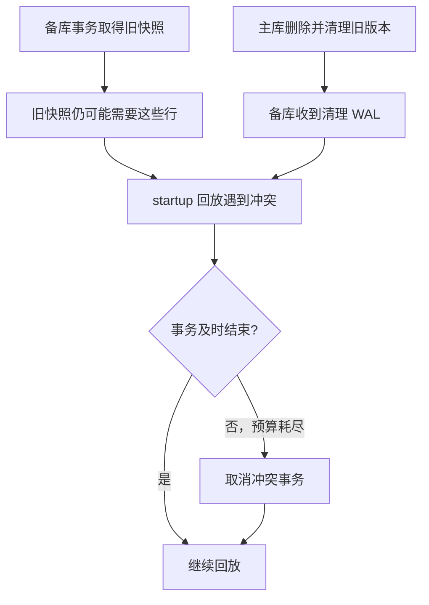

# All Your GUCs in a Row: max_standby_archive_delay and max_standby_streaming_delay

一条报表 SQL 在备库上跑了几秒，突然收到错误：

```text
ERROR:  canceling statement due to conflict with recovery
DETAIL:  User query might have needed to see row versions that must be removed.
```

查了配置，`max_standby_streaming_delay` 明明是 30 秒。为什么没等够？把它调大以后，又为什么会出现报表正常、备库数据却越来越旧的情况？

Christophe Pettus 在 The Build 的这篇文章中讨论了这组参数。本文围绕备库回放与只读事务之间的关系展开，并补充一组 PostgreSQL 18.4 物理流复制实验：查询如何被取消、连续冲突如何共用等待预算，以及反馈机制为什么挡不住某些 `VACUUM` 冲突。

## 主库已经完成的事，备库还要再做一次

物理备库通过回放 WAL，让数据页跟上主库的变化。这里的回放由 startup 进程负责；walreceiver 负责接收 WAL，接收完成并不表示这些变化已经能被查询看见。

假设备库上的事务取得了一个旧快照，仍有资格读取删除前的行版本。随后，主库删除这些行，再由 `VACUUM` 清掉旧版本。主库上没有事务需要它们，清理完全合法，但这条清理记录到达备库时，就与旧快照产生了冲突。

备库无法跳过这条 WAL、继续回放后面的记录。它要么等待旧事务结束，要么取消冲突事务，为回放让路。



这类问题称为恢复冲突，恢复指的是备库应用 WAL 的过程。除了旧快照，主库上的排他表锁、备库查询固定着的数据页，以及被删除的表空间，也可能妨碍回放。错误的 `DETAIL` 和冲突统计通常比“SQL 跑了多久”更能说明原因。

## 等待预算从 WAL 开始计算

两个参数都在备库生效，默认值为 `30s`，修改后 reload 即可。它们按 WAL 来源分工：

| 参数 | 适用的回放来源 | 等待预算的作用范围 |
| --- | --- | --- |
| `max_standby_streaming_delay` | 流复制接收到的 WAL | 回放已收到的 WAL，连续冲突会消耗可用时间 |
| `max_standby_archive_delay` | 从归档恢复的 WAL；源码中的本地非流式读取也走此分支 | 一个打开的 WAL 段内，前面的冲突会压缩后面的等待时间 |

写配置时最好带单位。裸数字按毫秒解释；`0` 表示不为这类冲突留等待时间，`-1` 表示不设等待期限。它们不会限制一条完全不妨碍回放的长查询，这种限制应由 `statement_timeout` 等机制承担。

startup 内部保存一个 WAL 接收时间基准 `XLogReceiptTime`。取消冲突事务的截止点可以写成：

```text
截止时刻 = 当前 WAL 接收时间基准 + 对应的 standby delay
```

流复制正常跟得上时，startup 进入最新收到的那批 WAL，时间基准随之推进；已经落后、还在处理旧批次时，基准不会为每个冲突重新刷新。归档路径在打开 WAL 段时记录时间，同一段里的查询也没有各自独立的完整预算。

例如预算为 30 秒，第一个冲突已经等了 28 秒。随后遇到另一个冲突，第二条查询可能只剩很短的宽限时间。即使它刚刚开始，也会被取消。反过来，一条读了五分钟但没有恢复冲突的查询，可以继续执行。

这个参数也不是总复制延迟的硬上限。网络中断、回放吞吐不足、主动暂停回放等问题，都可能让备库落后更久。

## 实验一：后来的查询只拿到剩余时间

准备一组可丢弃的物理流复制主备，使用同一版本 PostgreSQL。以下测试需要管理员权限，修改的是**测试备库**的实例配置。打开四个 psql 窗口：主库 P、备库查询 A、备库查询 B，以及备库观察窗口 O。

完整自动化脚本位于仓库的 `maintenance/109-verify.py`，会自行创建临时主备、执行下面的会话顺序并清理，不连接本机已有数据库：

```bash
python3 maintenance/109-verify.py --pg-bin /opt/homebrew/opt/postgresql@18/bin
```

Linux 可把 `--pg-bin` 换成本机 PostgreSQL 工具目录，以非 root 用户运行。手工复现时，先在 O 中记录下面三个参数的原值，再设置 4 秒预算，关闭反馈，缩短实验用的反馈间隔：

<!-- verify:configure -->
```sql
ALTER SYSTEM SET max_standby_streaming_delay = '4s';
ALTER SYSTEM SET hot_standby_feedback = off;
ALTER SYSTEM SET wal_receiver_status_interval = '1s';
SELECT pg_reload_conf();
```

reload 是异步操作。重新执行 `SHOW max_standby_streaming_delay`、`SHOW hot_standby_feedback`，确认分别为 `4s`、`off` 后继续。

在 P 中建表。`control` 是查询读取的表，另外两张表用来制造清理冲突；关闭这些测试表的 autovacuum，让执行顺序可控。

<!-- verify:setup -->
```sql
CREATE SCHEMA standby_demo;
CREATE TABLE standby_demo.control(id integer PRIMARY KEY);
INSERT INTO standby_demo.control VALUES (1);
CREATE TABLE standby_demo.victim_a(id integer, payload text)
  WITH (autovacuum_enabled = false);
CREATE TABLE standby_demo.victim_c(LIKE standby_demo.victim_a)
  WITH (autovacuum_enabled = false);
INSERT INTO standby_demo.victim_a
SELECT g, repeat('a', 100) FROM generate_series(1, 10000) AS g;
INSERT INTO standby_demo.victim_c
SELECT g, repeat('c', 100) FROM generate_series(1, 10000) AS g;
```

在 O 中确认两张 victim 表都能查到 10000 行。后文需要检查“回放追上主库”时，在 P 执行 `SELECT pg_current_wal_lsn()`，将返回位置代入 O 的 `SELECT pg_last_wal_replay_lsn() >= '主库返回的 LSN'::pg_lsn`，等结果为 `t` 再继续。比较字节位置比等待固定秒数更可靠。

然后按顺序操作，后两步要在前一个冲突的 4 秒预算内完成；手工切换窗口较慢，可以暂用 15 秒，观察相同机制。

**1. A 建立旧快照并持续执行查询。** `REPEATABLE READ` 让事务中的后续语句沿用这个快照；`pg_sleep` 用于把事务保持在执行状态。

<!-- verify:hold-a -->
```sql
SET statement_timeout = '30s';
BEGIN ISOLATION LEVEL REPEATABLE READ;
SELECT count(*) FROM standby_demo.control;
SELECT pg_sleep(20);
```

**2. P 删除并清理 victim_a。** `TRUNCATE FALSE` 只禁止尾部截断，行版本清理仍然执行，避免把快照冲突和表锁冲突混在一起。

<!-- verify:clean-a -->
```sql
DELETE FROM standby_demo.victim_a;
VACUUM (TRUNCATE FALSE) standby_demo.victim_a;
```

在 O 中观察 startup 是否正在等快照；看到 `RecoveryConflictSnapshot` 后，约等一秒，再进行下一步。

<!-- verify:observe -->
```sql
SELECT backend_type, wait_event_type, wait_event
FROM pg_stat_activity
WHERE backend_type = 'startup';
```

本次观察结果：

<!-- result:waiting -->
```text
 backend_type | wait_event_type |        wait_event
--------------+-----------------+--------------------------
 startup      | IPC             | RecoveryConflictSnapshot
(1 row)
```

**3. P 删除并清理 victim_c，随后 B 开始查询。** 此时回放仍被 A 卡住，victim_c 的变化排在后面。

<!-- verify:clean-c -->
```sql
DELETE FROM standby_demo.victim_c;
VACUUM (TRUNCATE FALSE) standby_demo.victim_c;
```

<!-- verify:hold-b -->
```sql
SET statement_timeout = '30s';
BEGIN ISOLATION LEVEL REPEATABLE READ;
SELECT count(*) FROM standby_demo.control;
SELECT pg_sleep(20);
```

A、B 都会收到开头的快照冲突错误，SQLSTATE 为 `40001`。下面是本轮记录的时间，以 A 开始执行附近为零点：

| 事件 | 相对时间 |
| --- | ---: |
| A 开始执行 pg_sleep | 0.00 秒 |
| P 完成 victim_a 的删除与清理 | 0.01 秒 |
| P 完成 victim_c 的删除与清理 | 1.29 秒 |
| B 开始执行 pg_sleep | 1.29 秒 |
| 观察到 A 被取消 | 4.10 秒 |
| 观察到 B 被取消 | 4.10 秒 |

观察窗口约每 25 毫秒采样一次，这轮在同一次采样中发现两条查询都已取消。A 执行了约 4.10 秒，B 只执行了约 2.81 秒，B 没有重新获得完整 4 秒。

注意，这两个事务只读取了 `control`。清理冲突按同一数据库中的快照年代筛选事务，并不要求事务已经读过 victim 表。旧快照仍允许事务随后读取其他表，回放必须考虑这一点。

在 A、B 中分别执行 `ROLLBACK`，然后 O 查看统计：

<!-- verify:conflicts -->
```sql
SELECT confl_snapshot, confl_lock
FROM pg_stat_database_conflicts
WHERE datname = current_database();
```

<!-- result:conflicts -->
```text
 confl_snapshot | confl_lock
----------------+------------
              2 |          0
(1 row)
```

这是新建备库的一轮结果；已有实例应比较测试前后的增量。

## 实验二：反馈保住查询，主库保留旧版本

`hot_standby_feedback` 会把备库需要保留的事务可见性边界反馈给上游。主库据此知道：有些行虽然已经被删除，备库的旧快照还需要它们，当前不能清掉。

在 O 开启反馈并确认 `SHOW hot_standby_feedback` 返回 `on`：

<!-- verify:feedback-config -->
```sql
ALTER SYSTEM SET hot_standby_feedback = on;
SELECT pg_reload_conf();
```

P 创建新表，等备库能看到 10000 行后继续：

<!-- verify:feedback-setup -->
```sql
CREATE TABLE standby_demo.feedback_rows(id integer, payload text)
  WITH (autovacuum_enabled = false);
INSERT INTO standby_demo.feedback_rows
SELECT g, repeat('f', 100) FROM generate_series(1, 10000) AS g;
```

A 中保持一个旧快照，这次读完后先停在事务内，不提交：

<!-- verify:feedback-hold -->
```sql
BEGIN ISOLATION LEVEL REPEATABLE READ;
SELECT count(*) FROM standby_demo.feedback_rows;
```

P 确认反馈已经到达。`backend_xmin` 是这个复制连接反馈的清理边界，数值由当前事务产生，不必照抄：

<!-- verify:feedback-check -->
```sql
SELECT application_name, backend_xmin
FROM pg_stat_replication;
```

等 `backend_xmin` 非空，再在 P 删除并执行清理：

<!-- verify:feedback-delete -->
```sql
DELETE FROM standby_demo.feedback_rows;
VACUUM (VERBOSE, TRUNCATE FALSE) standby_demo.feedback_rows;
```

本次 VACUUM 的关键输出为：

<!-- result:retained -->
```text
tuples: 0 removed, 10000 remain, 10000 are dead but not yet removable
```

O 使用新的查询快照能看到删除后的 0 行；A 再次 `SELECT count(*) FROM standby_demo.feedback_rows` 仍返回 10000，说明旧版本和旧快照都还在。等待超过 4 秒也没有发生快照取消，因为这次没有生成需要赶走 A 的行版本清理记录。

A 执行 `ROLLBACK` 后，等 P 中 `backend_xmin` 向前推进，不再受这个旧快照约束，再清理一次。反馈仍开启时，这个值不一定变成 NULL；如果仍有不可清理的死行，确认反馈已更新，再重跑这次测试 VACUUM：

<!-- verify:feedback-clean -->
```sql
VACUUM (VERBOSE, TRUNCATE FALSE) standby_demo.feedback_rows;
```

<!-- result:removed -->
```text
tuples: 10000 removed, 0 remain, 0 are dead but not yet removable
```

反馈把代价移到了主库的版本保留。报表事务持续越久、主库更新越多，积累的旧版本就可能越多，影响表和索引空间以及后续清理工作。开启后应同时观察备库查询年龄、主库 `backend_xmin` 和表膨胀；只看取消次数下降，还不足以判断这个设置是否合适。

## 普通 VACUUM 也能带来表锁冲突

开启反馈后仍被取消，要继续看错误详情。下面这种错误与旧版本清理不同：

```text
DETAIL:  User was holding a relation lock for too long.
```

普通 `VACUUM` 通常可以与查询并发，但它会尝试截掉表尾的空页，把空间归还操作系统。截断阶段需要 `AccessExclusiveLock`，这种锁会随 WAL 在备库回放，与读表事务持有的 `AccessShareLock` 冲突。

用一张已经清空、但仍占有数据页的表可以单独验证。P 执行：

<!-- verify:truncate-setup -->
```sql
CREATE TABLE standby_demo.empty_tail(id integer, payload text)
  WITH (autovacuum_enabled = false);
INSERT INTO standby_demo.empty_tail
SELECT g, repeat('t', 100) FROM generate_series(1, 10000) AS g;
DELETE FROM standby_demo.empty_tail;
```

先等备库查到 0 行、回放追上主库，再等反馈边界推进，然后 P 清理行版本，但暂不截断：

<!-- verify:truncate-clean -->
```sql
VACUUM (VERBOSE, TRUNCATE FALSE) standby_demo.empty_tail;
SELECT pg_relation_size('standby_demo.empty_tail')
       / current_setting('block_size')::integer AS heap_pages;
```

确认 VACUUM 输出的 `remain` 和 `dead but not yet removable` 都为 0；若反馈还没更新，等待后重跑这一段。测试中表文件仍有 173 页。等这次清理也回放完毕，A 执行下面的查询保持表锁：

<!-- verify:truncate-hold -->
```sql
BEGIN ISOLATION LEVEL REPEATABLE READ;
SELECT count(*) FROM standby_demo.empty_tail;
SELECT pg_sleep(20);
```

P 执行允许截断的 VACUUM：

<!-- verify:truncate-vacuum -->
```sql
VACUUM (VERBOSE, TRUNCATE TRUE) standby_demo.empty_tail;
SELECT pg_relation_size('standby_demo.empty_tail')
       / current_setting('block_size')::integer AS heap_pages;
```

这轮 VACUUM 输出包含：

<!-- result:tail -->
```text
INFO:  table "empty_tail": truncated 173 to 0 pages
```

主库表文件缩到 0 页，备库 A 随后收到错误：

<!-- result:lock-error -->
```text
ERROR:  canceling statement due to conflict with recovery
DETAIL:  User was holding a relation lock for too long.
```

A 执行 `ROLLBACK` 后，O 再查询前面的冲突统计：

<!-- result:final-conflicts -->
```text
 confl_snapshot | confl_lock
----------------+------------
              2 |          1
(1 row)
```

反馈仍然开启，却无法改变这个结果：它报告的是旧版本保留需求，不会把备库表锁转成主库上的表锁。

如果日志和 VACUUM 输出确认冲突来自尾部截断，可以在**主库**对相关表设置 `vacuum_truncate = off`，或给手动 VACUUM 加 `TRUNCATE FALSE`。表级选项从 PostgreSQL 12 开始提供，PostgreSQL 18 还提供同名配置参数。关闭截断后，空页仍可供表复用，只是不在这一步把表尾空间归还操作系统；不要为了保护查询关闭整个 autovacuum。

## 线上排查先分清是哪一种冲突

在备库持续采集 `pg_stat_database_conflicts` 的增量，并结合错误详情：

| 观察结果 | 优先排查 | 调整的依据 |
| --- | --- | --- |
| `confl_snapshot` 增长 | 长只读事务、主库更新与清理 | 评估反馈能否减少清理冲突，及主库能否承担版本保留 |
| `confl_lock` 增长 | DDL、显式排他锁、VACUUM 尾部截断 | 找到产生锁的操作；反馈不能解决这类冲突 |
| `confl_bufferpin` 增长 | 长时间固定数据页的查询或游标 | 结合冲突日志定位查询，缩短持有时间 |
| startup 等冲突，接收位置还在推进 | WAL 已收到但回放被挡住 | 对照查询取消与回放积压变化，确认等待预算是否符合用途 |

在主库看接收、持久化和回放的进度差：

<!-- verify:replication-status -->
```sql
SELECT application_name, state, sync_state,
       write_lag, flush_lag, replay_lag, backend_xmin,
       pg_wal_lsn_diff(pg_current_wal_lsn(), replay_lsn)
         AS replay_gap_bytes
FROM pg_stat_replication;
```

`replay_lag` 反映最近 WAL 的回放确认延迟，空闲时可能变为 NULL；`replay_gap_bytes` 是尚未回放的字节差，不是剩余秒数。不能只用“当前时间减最后回放事务时间”判断故障：主库没写入时，那个事务时间也会一直变旧。

必要时在备库开启 `log_recovery_conflict_waits`，它在恢复冲突等待超过 `deadlock_timeout` 时记录日志。结合等待原因、冲突 PID 和时间段，再关联主库的清理或 DDL。

应用遇到 `40001` 时，应回滚并从新事务重试，取得新快照。只在原事务中重新发送失败语句无法继续。空闲事务或某些子事务场景可能直接收到 FATAL，连接池需要丢弃断开的连接；重试要有次数和退避限制，持续冲突不能靠无限重试解决。

## 参数选择取决于备库承担什么工作

故障切换备库应优先保持回放进度。报表如果经常与清理冲突，可以优化查询、缩短事务或拆到专用报表副本，再评估是否增加等待预算和开启反馈。

专用报表副本可以接受更长的回放等待，但要把数据新鲜度作为明确约束：允许报表晚几分钟看到写入，还是必须几秒内可见？`-1` 会允许冲突事务无限挡住回放，监控和运维不能再假设它总能及时追上。

回放落后与数据丢失也应分别判断。WAL 若已经持久化在备库上，只是尚未应用，首先影响的是查询新鲜度和提升前的回放工作；故障后会不会丢数据，还取决于确认写入时的复制与持久化条件。如果该备库参与 `synchronous_commit = remote_apply` 的同步确认，回放受阻还可能让主库提交一起等待。

有些恢复冲突也不遵循这组等待预算，例如回放 `DROP DATABASE` 会终止对应数据库中的连接。调整参数时，应围绕实际错误类型验证效果，而不是承诺所有备库查询都能得到相同保护。

实验完成后，A、B 分别 `ROLLBACK`，P 删除测试 schema：

<!-- verify:cleanup -->
```sql
DROP SCHEMA standby_demo CASCADE;
```

O 将三个修改过的参数恢复到实验前的值，再 reload；A、B 恢复各自实验前的 `statement_timeout`。自动脚本直接停止并删除自己的临时实例，无需调整已有数据库。

继续排查复制延迟可读 [排查流复制延迟](/docs/93.md)；主库清理受旧快照影响的机制见 [Autovacuum 为什么跟不上](/docs/102.md)。

## 参考资料

- Christophe Pettus：[All Your GUCs in a Row: max_standby_archive_delay and max_standby_streaming_delay](https://thebuild.com/blog/all-your-gucs-in-a-row-max_standby_archive_delay-and-max_standby_streaming_delay/)，The Build，2026-09-26。
- PostgreSQL 18：[备库复制参数](https://www.postgresql.org/docs/18/runtime-config-replication.html#RUNTIME-CONFIG-REPLICATION-STANDBY)、[Hot Standby 冲突处理](https://www.postgresql.org/docs/18/hot-standby.html#HOT-STANDBY-CONFLICT)、[同步提交与 remote_apply](https://www.postgresql.org/docs/18/runtime-config-wal.html#GUC-SYNCHRONOUS-COMMIT)。
- PostgreSQL 18：[复制和恢复冲突统计](https://www.postgresql.org/docs/18/monitoring-stats.html)、[VACUUM 的 TRUNCATE 选项](https://www.postgresql.org/docs/18/sql-vacuum.html)、[vacuum_truncate 配置](https://www.postgresql.org/docs/18/runtime-config-vacuum.html#GUC-VACUUM-TRUNCATE)。
- PostgreSQL 18.4 源码：[standby.c](https://github.com/postgres/postgres/blob/REL_18_4/src/backend/storage/ipc/standby.c) 中的截止时刻与冲突处理，[xlogrecovery.c](https://github.com/postgres/postgres/blob/REL_18_4/src/backend/access/transam/xlogrecovery.c) 中的 WAL 时间基准，以及 [postgres.c](https://github.com/postgres/postgres/blob/REL_18_4/src/backend/tcop/postgres.c) 中的语句取消与连接终止。

中文解读与技术校订：xiongcc。
