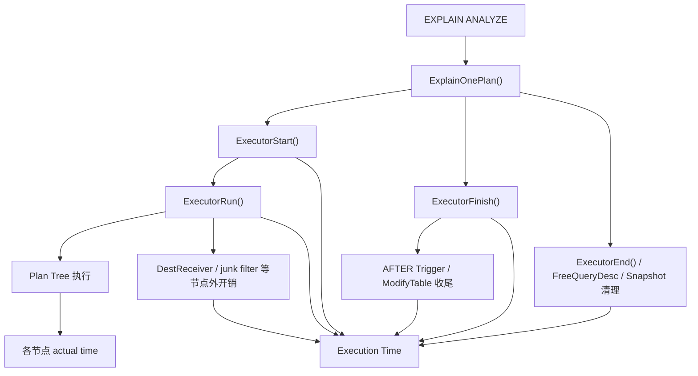
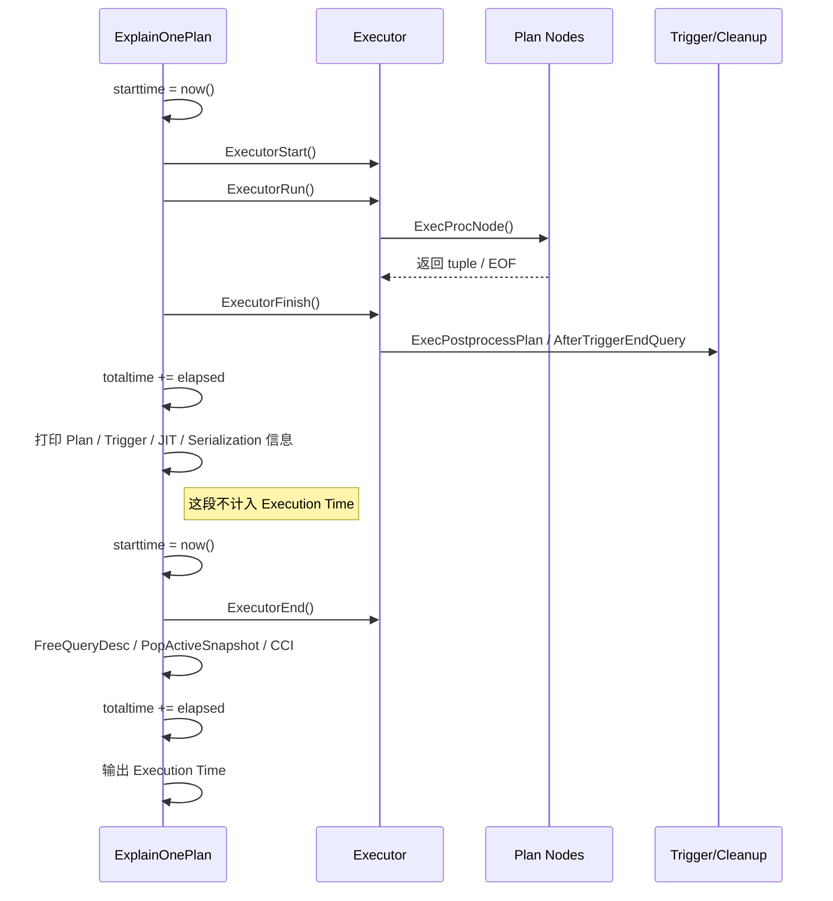

# 为什么 actual time 和 Execution Time 有很大差异？

## 前言

最近遇到一个挺有意思的问题：同一条 SQL，`EXPLAIN ANALYZE` 里某些节点的 `actual time` 看起来并不高，但最后的 `Execution Time` 却明显更大。

很多朋友第一反应是：是不是 PostgreSQL 统计错了？

其实不是。

这里的关键在于：`actual time` 和 `Execution Time` 根本不是同一把尺子量出来的东西。一个量的是计划节点内部的执行时间，一个量的是整次 `EXPLAIN ANALYZE` 执行生命周期的墙钟时间。它们相关，但并不要求相等。

本文就从 PostgreSQL 18 源码出发，掰扯一下这两个时间到底从哪里来，又为什么经常对不上。

## 一句话结论

先把结论放前面：

> `actual time` 是计划节点级别的 instrumentation，统计的是某个 PlanState 在 `ExecProcNode` 调用范围内的时间；  
> `Execution Time` 是 `ExplainOnePlan()` 外层统计的整次执行墙钟时间，覆盖 executor 启动、运行、收尾和部分资源释放。

所以我们不能简单拿“所有节点 actual time 之和”去对比 `Execution Time`，更不能认为根节点 `actual total time` 就一定等于 `Execution Time`。

它们的关系更像下面这样：



## actual time 是怎么来的？

先看节点上的 `actual time`。

在 PostgreSQL executor 里，每个计划节点都有一个 `PlanState`。真正执行节点时，会走 `ExecProcNode()`。如果开启了 `EXPLAIN ANALYZE` 且 `TIMING` 为 on，PostgreSQL 会给节点挂上 `Instrumentation`。

节点执行前后，会包一层计时：

```c
InstrStartNode(node->instrument);

result = node->ExecProcNodeReal(node);

InstrStopNode(node->instrument, TupIsNull(result) ? 0.0 : 1.0);
```

这段逻辑在 PostgreSQL 18 的 `src/backend/executor/execProcnode.c` 中。

再往下看，`InstrStartNode()` 和 `InstrStopNode()` 本质就是用 `instr_time` 记录开始和结束时间，然后把差值累加到节点自己的计数器里，代码在 `src/backend/executor/instrument.c`。

这里有几个要点：

第一，`actual time` 不是 CPU time，而是墙钟时间。如果节点内部发生 I/O、等待、锁等待、并行队列等待，只要发生在这个节点的计时范围内，都可能被算进去。

第二，节点时间是嵌套的。例如 Nested Loop 调用内层 Index Scan，父节点的时间里天然包含子节点的时间。所以把每一行节点的 `actual time` 加起来，基本一定会重复计算。

第三，显示值是按 loops 平均后的结果。输出时在 `src/backend/commands/explain.c` 中可以看到：

```c
startup_ms = 1000.0 * instrument->startup / nloops;
total_ms   = 1000.0 * instrument->total / nloops;
rows       = instrument->ntuples / nloops;
```

也就是说：

```text
actual time = startup_ms .. total_ms
```

其中 `startup_ms` 是该节点本轮执行到返回第一行的时间，`total_ms` 是该节点本轮执行完成的时间。

如果 `loops=1000`，那么 EXPLAIN 上展示的是平均每轮时间，而不是总时间。要估算该节点自身累计耗时，需要乘回 `loops`，但仍然要注意父子节点嵌套带来的重复问题。

## Execution Time 是怎么来的？

再看末尾的 `Execution Time`。

这个时间不是从某个计划节点里来的，而是在 `ExplainOnePlan()` 外层用 `instr_time` 统计出来的。核心代码在 `src/backend/commands/explain.c`。

大致流程如下：



源码里它分两段统计：

第一段从 `ExecutorStart()` 前开始，到 `ExecutorRun()` 和 `ExecutorFinish()` 之后结束。

第二段从 `ExecutorEnd()` 前开始，到 `FreeQueryDesc()`、`PopActiveSnapshot()`、`CommandCounterIncrement()` 之后结束。

最后输出：

```c
ExplainPropertyFloat("Execution Time", "ms", 1000.0 * totaltime, 3, es);
```

这就解释了一个核心问题：**Execution Time 的范围比 plan node 的 actual time 更大**。

它不只包含计划树跑起来的时间，还包含 executor 的启动、收尾、触发器、资源释放等阶段。

## 哪些东西会拉大差异？

### 1. ExecutorStart 很重

`ExecutorStart()` 会创建 `EState`、初始化表达式、初始化 plan state tree、初始化 result relation 等。

对于分区表，还可能做 runtime initial pruning。相关逻辑在 `src/backend/executor/execMain.c` 和 `src/backend/executor/execPartition.c`。

这些工作发生在第一次 `ExecProcNode()` 之前，所以进入 `Execution Time`，但不进入任何节点的 `actual time`。

如果你的 SQL 涉及大量分区、复杂表达式、很多 result relation，那么这里就可能不是“小开销”。

### 2. ExecutorFinish 里的触发器

对于 DML 来说，`ExecutorFinish()` 可能非常关键。

源码里它会做两件事：

```c
ExecPostprocessPlan(estate);
AfterTriggerEndQuery(estate);
```

位置在 `src/backend/executor/execMain.c`。

其中 `AfterTriggerEndQuery()` 会执行语句结束时需要立刻触发的 AFTER trigger，比如外键约束触发器。

触发器本身会单独显示在 EXPLAIN 的 `Trigger` 部分，代码在 `src/backend/commands/explain.c`。但它不属于普通 plan node 的 `actual time`。

所以如果看到：

```text
Trigger for constraint xxx: time=800.000 calls=10000
Execution Time: 1200.000 ms
```

不要奇怪，触发器时间就是会把 `Execution Time` 拉高。

### 3. ExecutorEnd 和资源释放

`Execution Time` 第二段包含 `ExecutorEnd()`、释放 executor state、释放 snapshot、`CommandCounterIncrement()` 等。

`ExecutorEnd()` 在 `src/backend/executor/execMain.c`。它会调用 `ExecEndPlan()`，并释放执行器相关资源。

通常这段不大，但如果涉及并行执行、FDW、自定义扫描、资源释放较重的节点，也可能看出差异。

### 4. DestReceiver 和节点外开销

计划节点返回 tuple 后，并不代表这行 tuple 已经完成了所有处理。

在 `ExecutePlan()` 里，`ExecProcNode(planstate)` 返回后，还可能做 junk filter，然后把 tuple 交给 `DestReceiver`。

这些逻辑处于节点外部，因此不计入某个 plan node 的 `actual time`，但位于 `ExecutorRun()` 里，所以会进入 `Execution Time`。

普通 `EXPLAIN ANALYZE SELECT` 默认使用 `None_Receiver`，这块通常很小。但如果是 `EXPLAIN (ANALYZE, SERIALIZE)`，PostgreSQL 会模拟输出序列化，这部分就可能明显起来。PG 18 里 serialization 还会单独输出 `Serialization` 小节，相关代码在 `src/backend/commands/explain_dr.c`。

### 5. JIT 编译

如果开启 JIT，表达式在准备执行时可能触发 `jit_compile_expr()`，位置在 `src/backend/executor/execExpr.c`。

JIT 的 generation、optimization、emission 会单独汇总显示在 `JIT` 小节。它们会影响整体执行耗时，但不一定能完全归属到某一个 plan node 的 `actual time` 里。

所以遇到 `Execution Time` 明显更大时，别忘了看一下 EXPLAIN 里有没有：

```text
JIT:
  Timing: Generation ...
```

### 6. 并行执行

并行查询是另一个容易让人误判的场景。

在并行计划里，leader 和 worker 是同时干活的。worker 的 instrumentation 会通过共享内存汇总回来，相关逻辑在 `src/backend/executor/execParallel.c`。

但 `Execution Time` 是 leader 视角看到的墙钟时间。

这意味着：

```text
worker1 actual 100 ms
worker2 actual 100 ms
worker3 actual 100 ms
Execution Time 可能只有 130 ms
```

这不是统计错了，而是 3 个 worker 同时跑，墙钟时间不会把它们简单相加。

## 一个容易踩的坑：不要把节点时间相加

很多人第一次看 EXPLAIN，会下意识把每个节点的 `actual total time` 加起来，然后跟 `Execution Time` 对比。

这个思路本身就不成立。

原因有两个：

第一，父节点包含子节点时间。例如 Hash Join 的时间包含读取外表、探测 hash 表等过程；它的子节点时间已经在父节点调用链里出现过了。

第二，并行 worker 时间和 leader 时间是重叠的。多个 worker 的时间相加，表达的是“工作量”味道更重，而不是一次查询经过了多少墙钟时间。

所以更合理的看法是：

```text
根节点 actual total time
  ≈ 计划树主执行路径的节点内耗时

Execution Time
  ≈ executor 生命周期的服务器端墙钟耗时

Planning Time + Execution Time
  ≈ 服务端处理这条 EXPLAIN ANALYZE 的主要耗时
```

如果再拿 psql 的 `\timing` 来比，还要加上客户端、网络、结果展示等因素，那又是另一把尺子了。

## 排查时怎么对齐？

实际分析时，推荐按这个顺序看：

1. 看根节点 `actual time` 和 `loops`：如果 `loops > 1`，先确认显示的是平均值，不是累计值。
2. 看有没有 `Trigger` 小节：DML、外键、级联动作、复杂触发器都可能让 `Execution Time` 明显变大。
3. 看有没有 `JIT` 小节：JIT 编译时间有时比执行本身还显眼。
4. 看有没有 `Serialization` 小节：特别是使用 `EXPLAIN (ANALYZE, SERIALIZE)` 时。
5. 看是不是并行计划：并行场景下，不要把 worker 时间简单相加。
6. 看是不是大量分区或复杂初始化：如果 `ExecutorStart` 很重，根节点 actual time 可能解释不了全部耗时。

## 总结

`actual time` 和 `Execution Time` 的差异，本质上不是 PostgreSQL 统计不准，而是统计口径不同。

`actual time` 更像是显微镜，盯着每个计划节点在执行回调里的表现。  
`Execution Time` 更像是秒表，从 executor 启动前按下，到 executor 收尾结束后停下。

所以，看到二者对不上时，不要急着怀疑数据库。先问三个问题：

```text
有没有节点外的 executor 开销？
有没有 Trigger / JIT / Serialization？
有没有 loops / 并行 / 嵌套重复计算？
```

把这三个问题想清楚，`EXPLAIN ANALYZE` 里的时间就会从一堆数字，变成一张有边界、有层次的执行地图。
