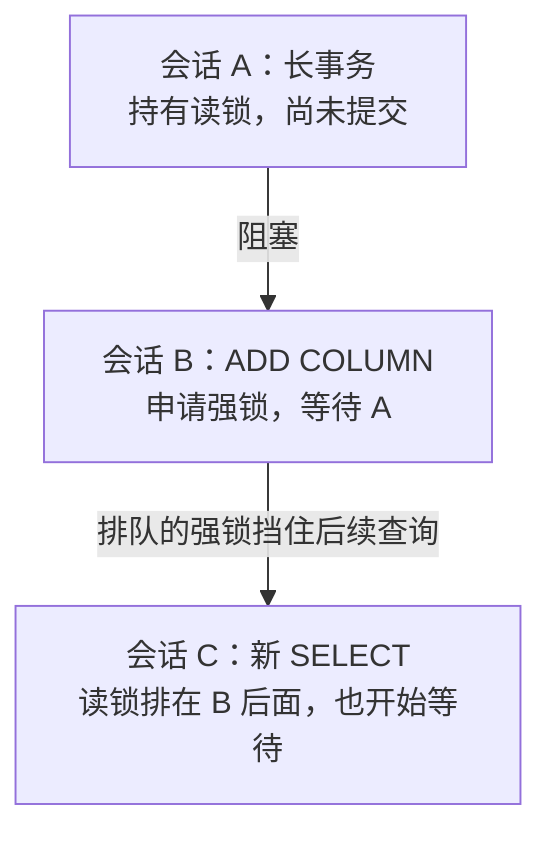

# 如何安全执行 PostgreSQL 在线变更：DDL、数据回填与批量删除

> 会议精选 · PGConf.DE 2026 · 锁、事务与在线变更  
> 基于 Daria Nikolaenko（Data Egret）的 [PostgreSQL Migrations Without Drama](https://dataegret.com/wp-content/uploads/2026/04/DariaNikolaenko-pgconf2026.reveal.pdf) 整理，演讲日期：2026-04-21。  
> 中文整理与技术校订：xiongcc。本文按操作场景重组演讲内容，补充事务边界、风险说明和验证，不是逐页直译。

给表加一列，在测试库里可能只需要几毫秒。到了生产环境，同一条 SQL 却迟迟不结束，连接数不断上涨，原本正常的查询也开始超时。

变更还没真正开始执行，业务已经受到影响。这是 PostgreSQL 在线变更中很容易被低估的风险。

本文讨论应用发布时的表结构变更和数据变更：加列、加约束、修改类型、回填数据及批量删除，不涉及跨数据库迁移或主版本升级。目标是让操作可以观察、可以暂停，失败后知道如何处理。示例秒数和批大小需要根据业务延迟预算和演练结果调整。

## 1. 等锁的 DDL，也会堵住后面的查询

假设有三个会话访问同一张表：



普通 SELECT 本来可以并发，但 B 申请的强锁排在前面，后续查询也可能需要等待。B 不必先拿到锁，就能让阻塞队列扩大。事务里的查询即使执行完，相关表锁通常也要等事务结束才释放。

B 等锁超时并回滚后，C 可以越过这个阻塞点，不必等 A 的读事务结束。这里的读锁指 `AccessShareLock`，ADD COLUMN 申请的是 `AccessExclusiveLock`。

所以，“不重写表”“只修改元数据”并不等于“没有锁风险”。它们主要说明拿到锁以后需要做多少工作。

先查直接阻塞关系：

<!-- example: blockers -->
```sql
SELECT waiting.pid AS blocked_pid,
       blocker.pid AS blocker_pid,
       blocker.state AS blocker_state,
       waiting.query AS blocked_query,
       blocker.query AS blocker_query
FROM pg_stat_activity AS waiting
CROSS JOIN LATERAL unnest(pg_blocking_pids(waiting.pid)) AS p(pid)
JOIN pg_stat_activity AS blocker ON blocker.pid = p.pid
WHERE waiting.wait_event_type = 'Lock';
```

需要有权限查看其他会话信息。该查询展示直接阻塞者，不是完整锁树；预备事务没有普通后端会话，也可能被 JOIN 漏掉。复杂情况继续看 [锁树分析](/docs/42.md) 和 [DDL 被什么阻塞](/docs/71.md)。

## 2. 执行之前，给变更划定边界

| 检查项 | 要回答的问题 |
| --- | --- |
| 数据规模 | 影响多少行？表和索引多大？是否扫描或重写整表？ |
| 当前负载 | 有没有长事务、未结束的事务、VACUUM、建索引或备份任务？ |
| 资源余量 | 磁盘、WAL、I/O 和 CPU 能否承受额外负载？ |
| 复制与 CDC | 是否需要调整订阅端结构？复制槽会不会持续保留 WAL？ |
| 应用兼容 | 新旧版本应用能否并存？改名、删除影响哪些依赖？ |
| 停止与恢复 | 什么指标触发暂停？已提交的批次如何核对、补做或恢复？ |

备库长查询不直接持有主库的表锁，但可能与 WAL 回放冲突，或通过 `hot_standby_feedback` 影响主库清理。内置逻辑复制不会自动复制 DDL，不能只改发布端就认为完成了迁移。

尽量用规模、索引和并发接近生产的环境演练。空表上执行成功，只能证明语法没有明显问题。

### 等锁和执行，分别设上限

短 DDL 可以采用以下事务模板：

<!-- example: timeout-ddl -->
```sql
BEGIN;
SET LOCAL lock_timeout = '3s';
SET LOCAL statement_timeout = '60s';
ALTER TABLE events ADD COLUMN source text;
COMMIT;
```

`lock_timeout` 限制单次锁获取的等待时间；`statement_timeout` 限制单条语句耗时，包含等锁时间，不是整个事务的总时长。通常让前者短于后者，避免 DDL 长期挂在锁队列里。

报错后显式事务会进入失败状态，需要 `ROLLBACK`。先判断原因，再决定是否有限重试，并设置退避。不要让脚本每隔几毫秒重新排一次强锁。迁移工具如果自动包装事务，也要核对其行为。

超时不替代回退方案，不会撤销已提交批次，也不保证所有清理工作都在超时瞬间完成。

## 3. 加约束：把定义和扫描验证分开

### CHECK：先管住新数据，再检查旧数据

直接添加 CHECK，可能在强锁持有期间扫描已有数据。对大表，可以先定义 `NOT VALID` 约束，提交后再验证：

<!-- example: check-add -->
```sql
BEGIN;
SET LOCAL lock_timeout = '3s';
SET LOCAL statement_timeout = '60s';
ALTER TABLE subscriptions ADD CONSTRAINT subscriptions_valid_period
    CHECK (ends_at > starts_at) NOT VALID;
COMMIT;
```

接着在另一个事务中验证，给扫描配置合适的预算：

<!-- example: check-validate -->
```sql
BEGIN;
SET LOCAL lock_timeout = '3s';
SET LOCAL statement_timeout = '30min';
ALTER TABLE subscriptions VALIDATE CONSTRAINT subscriptions_valid_period;
COMMIT;
```

第一步仍需短暂的 `AccessExclusiveLock`；第二步使用 `ShareUpdateExclusiveLock`。不要把两步放在同一个事务里，否则第一步的强锁会一直保留到事务结束。

`NOT VALID` 跳过的是已有行的立即验证，后续插入、更新仍受约束。验证失败后，要处理不合规旧数据再验证；已提交的约束定义仍在。另外，CHECK 表达式得到 NULL 不算违规，时间字段不能为 NULL 时还需 NOT NULL。

### 外键：同样分步，锁模式不同

下面两条语句分别提交，可套用上面的两个事务模板：

<!-- example: foreign-key -->
```sql
ALTER TABLE orders ADD CONSTRAINT orders_user_id_fk
    FOREIGN KEY (user_id) REFERENCES users(id) NOT VALID;
ALTER TABLE orders VALIDATE CONSTRAINT orders_user_id_fk;
```

**整理者校订：**演讲第 25 页合并描述了较安全方案涉及的锁，容易产生误解。添加外键，即使带 `NOT VALID`，在引用表和被引用表上仍需 `ShareRowExclusiveLock`；验证阶段使用引用表上的 `ShareUpdateExclusiveLock`，并需要被引用表上的 `RowShareLock`。[官方说明](https://www.postgresql.org/docs/18/sql-altertable.html)

检查引用列是否需要索引，尤其是父表会被删除、更新时。PostgreSQL 不自动在外键引用列上建索引，但也不要脱离表大小和访问方式机械地补索引。

### NOT NULL：注意版本

PG12–17 可以先验证 `CHECK (email IS NOT NULL)`，帮助最后的 SET NOT NULL 避免再次扫描整表：

<!-- example: not-null-legacy -->
```sql
-- 各阶段分别提交，按前面的模板设置超时。
ALTER TABLE users ADD CONSTRAINT users_email_nn_check
    CHECK (email IS NOT NULL) NOT VALID;
ALTER TABLE users VALIDATE CONSTRAINT users_email_nn_check;
ALTER TABLE users ALTER COLUMN email SET NOT NULL;
ALTER TABLE users DROP CONSTRAINT users_email_nn_check;
```

PG18 支持直接声明未验证的 NOT NULL 约束：

<!-- example: not-null-pg18 -->
```sql
ALTER TABLE users
    ADD CONSTRAINT users_email_not_null NOT NULL email NOT VALID;
ALTER TABLE users VALIDATE CONSTRAINT users_email_not_null;
```

仍应分阶段提交并考虑锁等待。这简化了步骤，没有消除验证扫描。

### UNIQUE：先并发建索引，再挂约束

<!-- example: unique-index -->
```sql
-- 独立会话执行，不放进 BEGIN/COMMIT 或迁移工具的事务包装。
SET lock_timeout = '3s';
SET statement_timeout = '30min';
CREATE UNIQUE INDEX CONCURRENTLY users_email_idx ON users (email);
RESET lock_timeout;
RESET statement_timeout;
```

确认成功后，再做短 DDL：

<!-- example: unique-attach -->
```sql
BEGIN;
SET LOCAL lock_timeout = '3s';
SET LOCAL statement_timeout = '60s';
ALTER TABLE users ADD CONSTRAINT users_email_key
    UNIQUE USING INDEX users_email_idx;
COMMIT;
```

`CONCURRENTLY` 降低对正常写入的阻塞，但会增加扫描，仍可能等待其他事务，也会消耗 I/O。失败后可能留下无效索引，要检查 `pg_index.indisvalid` 等状态再清理或重试，不能用 `IF NOT EXISTS` 掩盖失败。

示例针对普通表、普通列的完整唯一 B-tree 索引。表达式索引、部分索引、分区表以及主键的非空要求需要额外处理。[并发建索引限制](https://www.postgresql.org/docs/18/sql-createindex.html)

## 4. 加列与改类型：先确认会不会重写表

PG11 起，添加带非 volatile 默认值的普通列，可以利用快速默认值机制避免重写已有行。例如 `now()` 和 `clock_timestamp()` 行为不同，后者是 volatile 函数。省去重写仍需拿锁，其他约束或子命令也可能引入额外工作。

必须使用 volatile 默认值时，可以将新写入默认值与历史回填分开：

<!-- example: volatile-default -->
```sql
BEGIN;
SET LOCAL lock_timeout = '3s';
SET LOCAL statement_timeout = '60s';
ALTER TABLE events ADD COLUMN processed_at timestamptz;
ALTER TABLE events ALTER COLUMN processed_at
    SET DEFAULT clock_timestamp();
COMMIT;
```

提交后再分批回填历史行。这里将默认值设置放在回填之前，减少期间新插入记录漏填的窗口；但应用显式写入 NULL 不会触发默认值，仍要约定写入行为并核对结果。

注意数据语义：回填时调用 `clock_timestamp()` 得到处理时间，不是历史事件发生时间。不能为了填满一列而改变它的含义。

是否重写取决于具体类型、长度约束和转换表达式。不能把“text 与 varchar 可兼容”扩大成“所有 varchar 长度变更都不重写”。即使不重写表，索引也可能重建，查询计划也可能变化。

对 integer 到 bigint 之类的变更，演讲建议新增目标列、同步新写入、分批回填、准备索引约束，再切换应用。这个方向可行，但两次 RENAME 并不足以完成迁移：视图、外键等依赖跟随原列身份，不一定因同名替换就指向新列。必须检查依赖、双写一致性、切换并发和旧应用兼容性。这里不提供省略这些环节的“万能改名脚本”。

## 5. 批量修改：每批都要真正结束事务

把 UPDATE 改成循环，每次处理 5,000 行，并不自动成为“小事务”。外面仍包着大事务，行锁和旧版本保留等问题就可能持续到最后提交。

演讲第 38 页反例还有第二个问题：按 `created_at` 筛选，却更新 `status`。下轮条件不变，已处理的行还会再次命中，循环可能无法结束。

一个可用的分批任务至少应满足：每批独立提交；成功后记录退出待处理集合或推进可靠游标；保留批次行数、耗时；错误后停止或有限重试；完成后用业务条件复核。不要用大 OFFSET 寻找下一批。

### 一个可以反复执行的 UPDATE 批次

以下使用演讲中的 ctid 思路，假定 `work_item` 是普通、非继承、非分区表：

<!-- example: update-batch -->
```sql
WITH batch AS (
    SELECT ctid
    FROM ONLY work_item
    WHERE status = 'active' AND num_retries > 10
    ORDER BY retry_timestamp, id
    LIMIT 5000
    FOR UPDATE
), updated AS (
    UPDATE ONLY work_item AS w
    SET status = 'failed'
    FROM batch AS b
    WHERE w.ctid = b.ctid
    RETURNING 1
)
SELECT count(*) AS rows_updated FROM updated;
```

更新后状态不再为 active，下轮不会重复处理。ctid 只在同一条语句里定位已锁定的行，不保存为长期进度标记；它随 UPDATE 或表重写变化，也不是跨分区唯一标识。[系统列说明](https://www.postgresql.org/docs/18/ddl-system-columns.html)

`ONLY` 明确限制目标关系，不能原样用于分区父表。分区场景应选择具体叶子分区，或设计包含关系身份、业务键的方案。

这里没有默认加入 `SKIP LOCKED`：如果剩余记录都被锁住，返回 0 不代表完成。多 worker 并行可以使用它，但必须补上重试和最终核对。

### 由外部脚本控制批次

将上一段 SQL 原样放入 `batch.sql`。以下 Bash 脚本每次创建独立 psql 连接，以自动提交方式执行一个批次：

```bash
#!/usr/bin/env bash
set -euo pipefail

# 连接使用 PGHOST、PGPORT、PGDATABASE、PGUSER 及 .pgpass 配置。
max_batches=1000
for ((i=1; i<=max_batches; i++)); do
  rows=$(PGOPTIONS="${PGOPTIONS:-} -c lock_timeout=3s -c statement_timeout=60s" \
    psql -XAt -v ON_ERROR_STOP=1 -f batch.sql)
  [[ "$rows" =~ ^[0-9]+$ ]] || { echo "Unexpected result: $rows" >&2; exit 1; }
  printf 'batch=%s rows=%s\n' "$i" "$rows"
  if [[ "$rows" == 0 ]]; then
    exit 0
  fi
  sleep 0.2
done
echo 'Batch limit reached; inspect workload and remaining rows before resuming.' >&2
exit 2
```

`batch.sql` 不要包住全部批次，也不要往标准输出增加其他查询结果。连接或 SQL 报错会让脚本退出；成功批次已提交，重新执行时继续处理剩余集合。

如果业务持续产生符合条件的新记录，要先确定范围，例如固定截止时间或业务高水位。否则这是持续消费任务，未必能清空。批次数上限只是保护措施，不是成功条件。

**整理者补充：**不能笼统说所有 DO 块都无法分批提交。满足调用条件的顶层 DO 或存储过程可以控制事务；演讲反例没有批次提交，而且迁移工具还可能在外面包装事务。这里选外部脚本，方便观察边界。[DO 事务控制限制](https://www.postgresql.org/docs/18/sql-do.html)

### DELETE 使用同样的边界

按时间分区且保留策略与分区边界一致时，先评估移除整个分区。`DETACH PARTITION CONCURRENTLY` 有版本、事务和默认分区等限制，也可能等待，不是通用的无锁删除。

普通表可以按固定截止时间分批删除：

<!-- example: delete-batch -->
```sql
WITH batch AS (
    SELECT ctid
    FROM ONLY events
    WHERE created_at < TIMESTAMPTZ '2026-02-28 00:00:00+00'
    ORDER BY created_at, id
    LIMIT 10000
    FOR UPDATE
), deleted AS (
    DELETE FROM ONLY events AS e
    USING batch AS b
    WHERE e.ctid = b.ctid
    RETURNING 1
)
SELECT count(*) AS rows_deleted FROM deleted;
```

同样交给脚本，每批独立提交。但 LIMIT 不等于耗时受控：找出这些行可能很贵，排序、触发器、级联删除和外键检查也会增加工作。要检查计划、索引和实际耗时。

演讲给出了按逻辑键、ctid、ctid 范围分批的速度排序。这里不将其作为通用结论，数据分布、选择率、索引和缓存状态都会改变结果。先保证语义和进度可控，再测性能。

## 6. 执行中能停，结束后有验收

迁移期间同时观察：

- 新的锁等待、业务延迟和错误率是否超过约定阈值。
- WAL、复制槽保留量、备库回放及 CDC 消费是否持续落后。
- 磁盘余量、I/O 延迟、CPU 和临时文件是否异常。
- 每批耗时是否恶化，剩余工作量是否减少。

可参考 [xmin 监控](/docs/45.md)、[WAL 增长排查](/docs/31.md) 和 [复制延迟排查](/docs/93.md)。阈值应提前约定，超出后暂停后续批次，不要等磁盘耗尽再处理。

结束后检查数据条件、约束验证状态、索引有效性、应用行为和复制。需要时 ANALYZE；大量修改后检查死元组、膨胀，安排 VACUUM。普通 VACUUM 主要让空间可重用，不保证把表文件缩回去。`pg_repack` 也不是删除后必做步骤，它需要额外资源、权限和锁窗口，应单独评估。

未提交 DDL 可以回滚；已经提交的分批删除，不能靠最后一个 ROLLBACK 找回来。不可逆操作必须提前准备并演练恢复或补偿方案。

## 小结

先查清楚变更会拿什么锁、读写多少数据，再决定如何拆分。强锁步骤尽量短，长扫描单独做；批量修改每批独立提交，并且能证明处理范围正在缩小。

这比“SQL 在测试库跑过了”更接近一份可以执行的生产变更方案。

## 来源、校订与验证

- 原演讲：[PostgreSQL Migrations Without Drama](https://dataegret.com/wp-content/uploads/2026/04/DariaNikolaenko-pgconf2026.reveal.pdf)，Daria Nikolaenko，PGConf.DE 2026。[会议介绍](https://www.postgresql.eu/events/pgconfde2026/sessions/)
- 主要依据是第 20 页锁队列、第 23–32 页 DDL、第 34–39 页批量修改。事务模板、可退出批次、外部脚本和部分边界说明由整理者补充。
- 第 33 页外键性能数据的单位和实验条件存在疑点，本文不采用，也不猜测正确值。其他演讲耗时不作为通用性能承诺。
- 验证范围与复现方法见 [第 99 篇验证记录](/maintenance/99-validation.md)。PG18 的 NOT NULL 写法按官方文档核对，不冒充本地实测。

继续阅读：[会议精选](/docs/conferences.md) · [专题索引](/docs/topics.md) · [推荐路径](/docs/paths.md)
